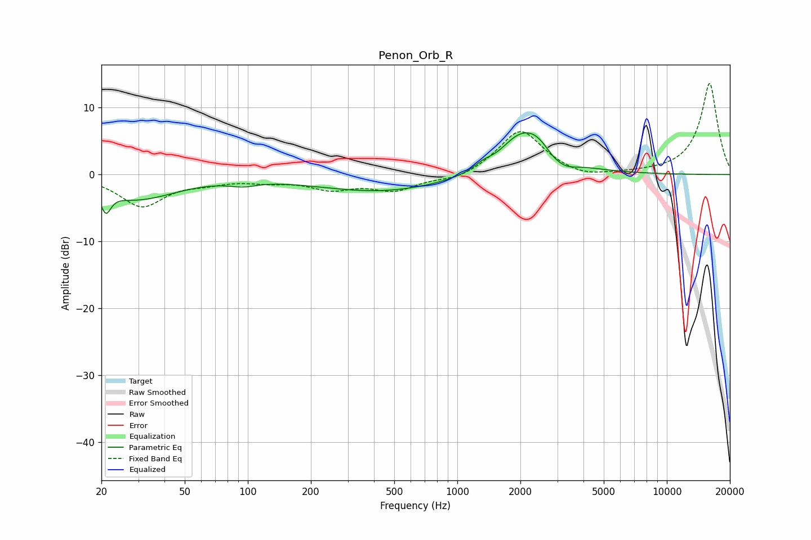

# Penon_Orb_R
See [usage instructions](https://github.com/jaakkopasanen/AutoEq#usage) for more options and info.

### Parametric EQs
Apply preamp of -6.3 dB when using parametric equalizer.

|   # | Type    |   Fc (Hz) |    Q |   Gain (dB) |
|-----|---------|-----------|------|-------------|
|   1 | Peaking |        21 | 5.91 |        -3.3 |
|   2 | Peaking |        26 | 1.4  |        -0.9 |
|   3 | Peaking |        33 | 0.77 |        -2.8 |
|   4 | Peaking |        95 | 2.18 |        -0.7 |
|   5 | Peaking |       435 | 0.45 |        -2.5 |
|   6 | Peaking |      1322 | 3.29 |         0.8 |
|   7 | Peaking |      1881 | 1.96 |         1.6 |
|   8 | Peaking |      2317 | 1.22 |         6.1 |
|   9 | Peaking |      2845 | 3.13 |        -1   |
|  10 | Peaking |      3261 | 2.4  |        -1.5 |

### Fixed Band EQs
When using fixed band (also called graphic) equalizer, apply preamp of **-13.7 dB** (if available) and set gains manually with these parameters.

|   # | Type    |   Fc (Hz) |    Q |   Gain (dB) |
|-----|---------|-----------|------|-------------|
|   1 | Peaking |        31 | 1.41 |        -4.6 |
|   2 | Peaking |        62 | 1.41 |        -0.9 |
|   3 | Peaking |       125 | 1.41 |        -0.8 |
|   4 | Peaking |       250 | 1.41 |        -1.9 |
|   5 | Peaking |       500 | 1.41 |        -2.2 |
|   6 | Peaking |      1000 | 1.41 |        -0.9 |
|   7 | Peaking |      2000 | 1.41 |         6.8 |
|   8 | Peaking |      4000 | 1.41 |        -0.8 |
|   9 | Peaking |      8000 | 1.41 |         0.1 |
|  10 | Peaking |     16000 | 1.41 |        13.7 |

### Graphs

