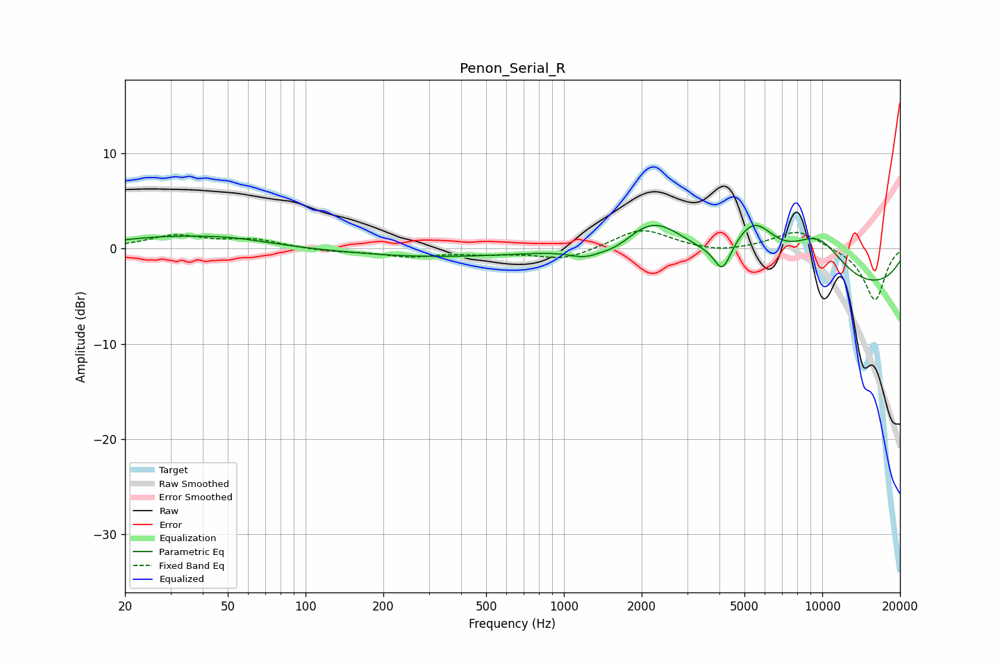

# Penon_Serial_R
See [usage instructions](https://github.com/jaakkopasanen/AutoEq#usage) for more options and info.

### Parametric EQs
Apply preamp of -2.5 dB when using parametric equalizer.

|   # | Type    |   Fc (Hz) |    Q |   Gain (dB) |
|-----|---------|-----------|------|-------------|
|   1 | Peaking |        26 | 0.77 |         0.8 |
|   2 | Peaking |        50 | 0.81 |         0.9 |
|   3 | Peaking |       312 | 0.43 |        -0.9 |
|   4 | Peaking |      1197 | 2.44 |        -0.8 |
|   5 | Peaking |      1606 | 1.71 |        -1.4 |
|   6 | Peaking |      2204 | 1.05 |         4.9 |
|   7 | Peaking |      4113 | 4.43 |        -2.8 |
|   8 | Peaking |      5434 | 1.6  |         5   |
|   9 | Peaking |      9583 | 1.12 |         5   |
|  10 | Peaking |     10000 | 0.21 |        -4.9 |

### Fixed Band EQs
When using fixed band (also called graphic) equalizer, apply preamp of **-2.0 dB** (if available) and set gains manually with these parameters.

|   # | Type    |   Fc (Hz) |    Q |   Gain (dB) |
|-----|---------|-----------|------|-------------|
|   1 | Peaking |        31 | 1.41 |         1.3 |
|   2 | Peaking |        62 | 1.41 |         0.9 |
|   3 | Peaking |       125 | 1.41 |        -0.3 |
|   4 | Peaking |       250 | 1.41 |        -0.8 |
|   5 | Peaking |       500 | 1.41 |        -0.4 |
|   6 | Peaking |      1000 | 1.41 |        -1.2 |
|   7 | Peaking |      2000 | 1.41 |         2.1 |
|   8 | Peaking |      4000 | 1.41 |        -0.5 |
|   9 | Peaking |      8000 | 1.41 |         2   |
|  10 | Peaking |     16000 | 1.41 |        -5.5 |

### Graphs

