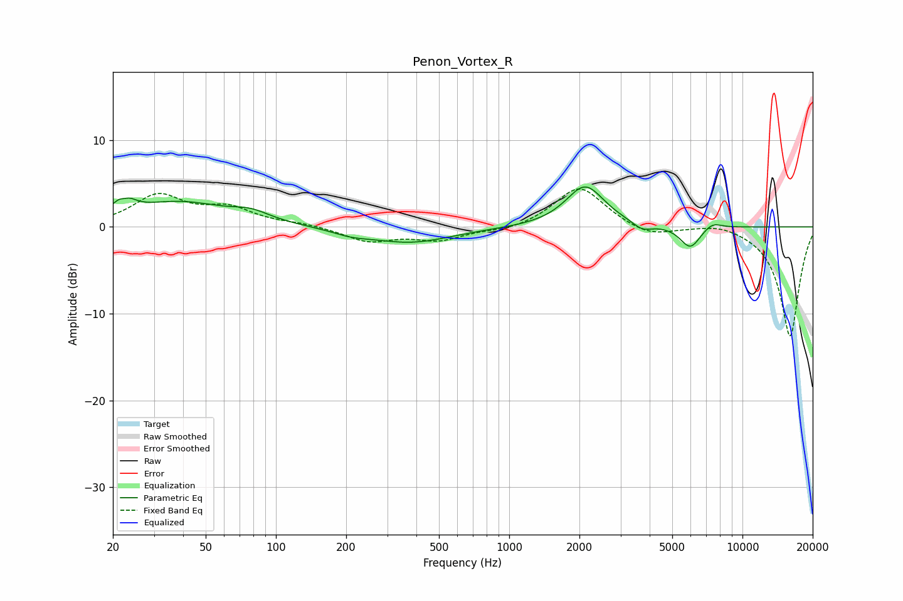

# Penon_Vortex_R
See [usage instructions](https://github.com/jaakkopasanen/AutoEq#usage) for more options and info.

### Parametric EQs
Apply preamp of -4.7 dB when using parametric equalizer.

|   # | Type    |   Fc (Hz) |    Q |   Gain (dB) |
|-----|---------|-----------|------|-------------|
|   1 | Peaking |        22 | 4.03 |         3.3 |
|   2 | Peaking |        22 | 5.8  |        -1.7 |
|   3 | Peaking |        38 | 0.7  |         2.8 |
|   4 | Peaking |        78 | 1.74 |         1   |
|   5 | Peaking |       210 | 1.74 |        -0.5 |
|   6 | Peaking |       377 | 0.79 |        -1.8 |
|   7 | Peaking |      2116 | 1.72 |         4.8 |
|   8 | Peaking |      3718 | 3.45 |        -0.9 |
|   9 | Peaking |      5974 | 3.17 |        -2.6 |
|  10 | Peaking |      7431 | 3.46 |         0.8 |

### Fixed Band EQs
When using fixed band (also called graphic) equalizer, apply preamp of **-4.5 dB** (if available) and set gains manually with these parameters.

|   # | Type    |   Fc (Hz) |    Q |   Gain (dB) |
|-----|---------|-----------|------|-------------|
|   1 | Peaking |        31 | 1.41 |         3.5 |
|   2 | Peaking |        62 | 1.41 |         1.9 |
|   3 | Peaking |       125 | 1.41 |         0.3 |
|   4 | Peaking |       250 | 1.41 |        -1.6 |
|   5 | Peaking |       500 | 1.41 |        -1.4 |
|   6 | Peaking |      1000 | 1.41 |        -0.5 |
|   7 | Peaking |      2000 | 1.41 |         4.7 |
|   8 | Peaking |      4000 | 1.41 |        -1.2 |
|   9 | Peaking |      8000 | 1.41 |         0.6 |
|  10 | Peaking |     16000 | 1.41 |       -12.7 |

### Graphs

