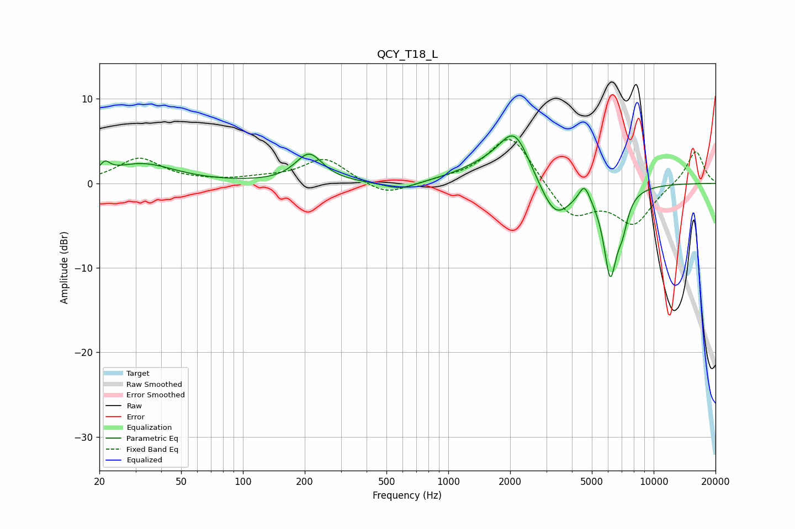

# QCY_T18_L
See [usage instructions](https://github.com/jaakkopasanen/AutoEq#usage) for more options and info.

### Parametric EQs
Apply preamp of -5.7 dB when using parametric equalizer.

|   # | Type    |   Fc (Hz) |    Q |   Gain (dB) |
|-----|---------|-----------|------|-------------|
|   1 | Peaking |        21 | 5.91 |         1.2 |
|   2 | Peaking |        32 | 0.89 |         2.3 |
|   3 | Peaking |       210 | 2.15 |         3.4 |
|   4 | Peaking |       583 | 1.72 |        -1   |
|   5 | Peaking |      1469 | 1.04 |         1.4 |
|   6 | Peaking |      2103 | 1.8  |         5.9 |
|   7 | Peaking |      3317 | 1.8  |        -4.6 |
|   8 | Peaking |      4598 | 5.36 |         2   |
|   9 | Peaking |      6148 | 4.11 |       -10.2 |
|  10 | Peaking |      7035 | 5.12 |        -2.7 |

### Fixed Band EQs
When using fixed band (also called graphic) equalizer, apply preamp of **-5.3 dB** (if available) and set gains manually with these parameters.

|   # | Type    |   Fc (Hz) |    Q |   Gain (dB) |
|-----|---------|-----------|------|-------------|
|   1 | Peaking |        31 | 1.41 |         2.9 |
|   2 | Peaking |        62 | 1.41 |         0.1 |
|   3 | Peaking |       125 | 1.41 |         0.5 |
|   4 | Peaking |       250 | 1.41 |         2.9 |
|   5 | Peaking |       500 | 1.41 |        -1.6 |
|   6 | Peaking |      1000 | 1.41 |         0.3 |
|   7 | Peaking |      2000 | 1.41 |         6   |
|   8 | Peaking |      4000 | 1.41 |        -4.1 |
|   9 | Peaking |      8000 | 1.41 |        -4.6 |
|  10 | Peaking |     16000 | 1.41 |         4   |

### Graphs

