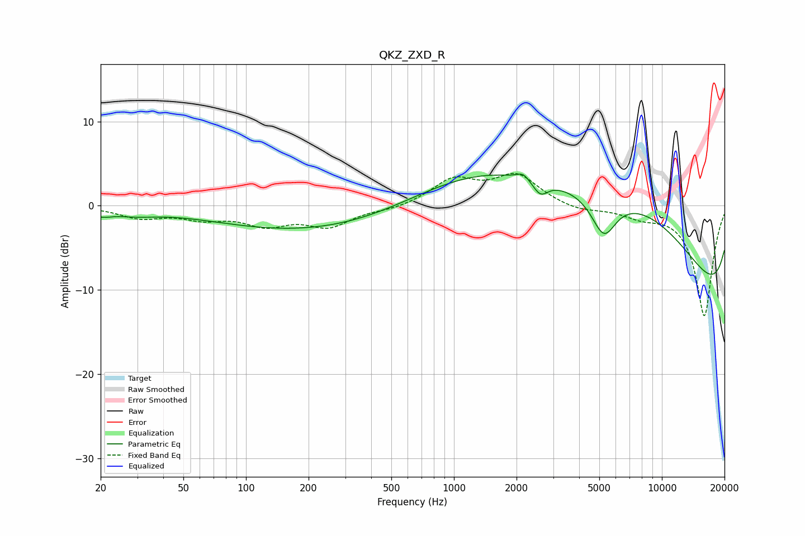

# QKZ_ZXD_R
See [usage instructions](https://github.com/jaakkopasanen/AutoEq#usage) for more options and info.

### Parametric EQs
Apply preamp of -3.8 dB when using parametric equalizer.

|   # | Type    |   Fc (Hz) |    Q |   Gain (dB) |
|-----|---------|-----------|------|-------------|
|   1 | Peaking |        20 | 2.74 |        -0.7 |
|   2 | Peaking |        29 | 1.32 |        -0.7 |
|   3 | Peaking |       215 | 0.29 |        -3.1 |
|   4 | Peaking |      2150 | 4.98 |         0.8 |
|   5 | Peaking |      2605 | 3.95 |        -1.7 |
|   6 | Peaking |      3849 | 0.18 |         7.3 |
|   7 | Peaking |      5260 | 2.31 |        -4.9 |
|   8 | Peaking |      7186 | 0.26 |        13.1 |
|   9 | Peaking |     10000 | 0.18 |       -10.3 |
|  10 | Peaking |     10000 | 0.18 |        -9.7 |

### Fixed Band EQs
When using fixed band (also called graphic) equalizer, apply preamp of **-3.9 dB** (if available) and set gains manually with these parameters.

|   # | Type    |   Fc (Hz) |    Q |   Gain (dB) |
|-----|---------|-----------|------|-------------|
|   1 | Peaking |        31 | 1.41 |        -1.3 |
|   2 | Peaking |        62 | 1.41 |        -1.3 |
|   3 | Peaking |       125 | 1.41 |        -2   |
|   4 | Peaking |       250 | 1.41 |        -2.3 |
|   5 | Peaking |       500 | 1.41 |        -0.4 |
|   6 | Peaking |      1000 | 1.41 |         3   |
|   7 | Peaking |      2000 | 1.41 |         3.5 |
|   8 | Peaking |      4000 | 1.41 |        -0.7 |
|   9 | Peaking |      8000 | 1.41 |        -1   |
|  10 | Peaking |     16000 | 1.41 |       -13.1 |

### Graphs

