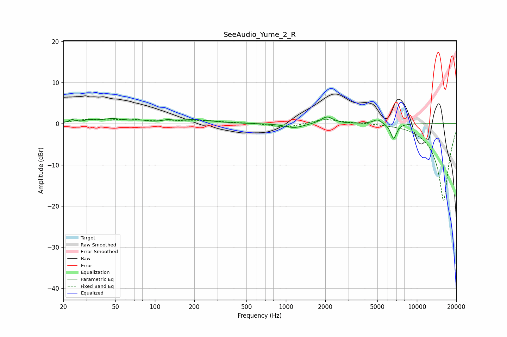

# SeeAudio_Yume_2_R
See [usage instructions](https://github.com/jaakkopasanen/AutoEq#usage) for more options and info.

### Parametric EQs
Apply preamp of -1.7 dB when using parametric equalizer.

|   # | Type    |   Fc (Hz) |    Q |   Gain (dB) |
|-----|---------|-----------|------|-------------|
|   1 | Peaking |        23 | 6    |         0.7 |
|   2 | Peaking |        31 | 4.23 |         0.5 |
|   3 | Peaking |        47 | 1.59 |         1.1 |
|   4 | Peaking |        77 | 2.84 |         0.4 |
|   5 | Peaking |       125 | 4.06 |         0.4 |
|   6 | Peaking |       199 | 1.11 |         0.9 |
|   7 | Peaking |      1160 | 2.03 |        -1.1 |
|   8 | Peaking |      2063 | 3.11 |         1.8 |
|   9 | Peaking |      5008 | 4.22 |         1.1 |
|  10 | Peaking |      6648 | 5.95 |        -3.7 |

### Fixed Band EQs
When using fixed band (also called graphic) equalizer, apply preamp of **-1.2 dB** (if available) and set gains manually with these parameters.

|   # | Type    |   Fc (Hz) |    Q |   Gain (dB) |
|-----|---------|-----------|------|-------------|
|   1 | Peaking |        31 | 1.41 |         0.9 |
|   2 | Peaking |        62 | 1.41 |         0.8 |
|   3 | Peaking |       125 | 1.41 |         0.6 |
|   4 | Peaking |       250 | 1.41 |         0.6 |
|   5 | Peaking |       500 | 1.41 |         0.2 |
|   6 | Peaking |      1000 | 1.41 |        -1   |
|   7 | Peaking |      2000 | 1.41 |         1.2 |
|   8 | Peaking |      4000 | 1.41 |         0.2 |
|   9 | Peaking |      8000 | 1.41 |         0.1 |
|  10 | Peaking |     16000 | 1.41 |       -18.8 |

### Graphs

