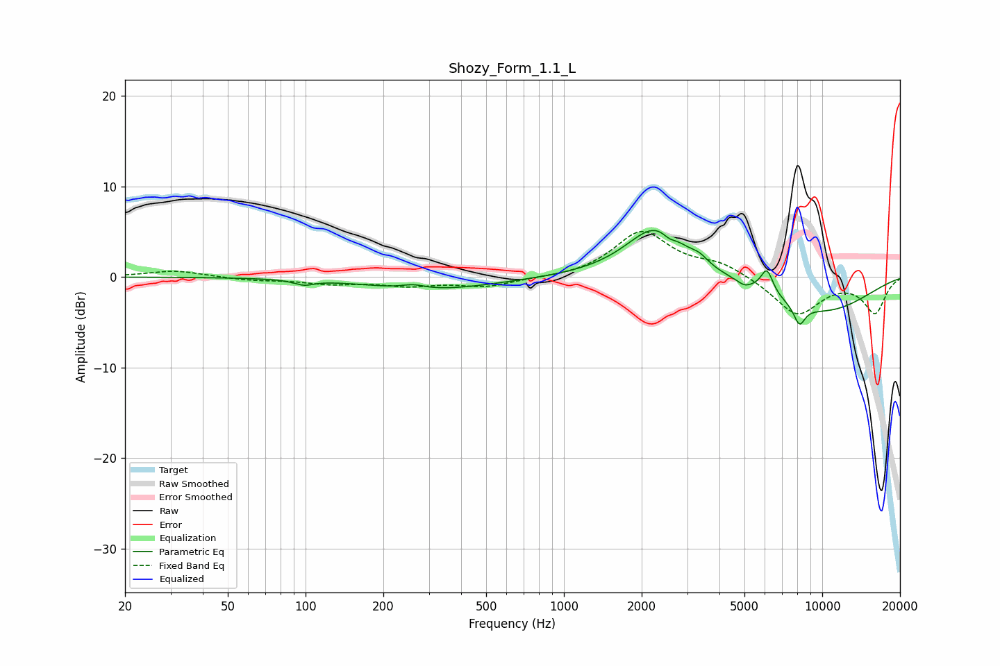

# Shozy_Form_1.1_L
See [usage instructions](https://github.com/jaakkopasanen/AutoEq#usage) for more options and info.

### Parametric EQs
Apply preamp of -5.2 dB when using parametric equalizer.

|   # | Type    |   Fc (Hz) |    Q |   Gain (dB) |
|-----|---------|-----------|------|-------------|
|   1 | Peaking |        99 | 3.79 |        -0.5 |
|   2 | Peaking |       262 | 3.28 |         0.4 |
|   3 | Peaking |       310 | 0.58 |        -1.4 |
|   4 | Peaking |      2289 | 1.2  |         5.8 |
|   5 | Peaking |      2553 | 5.7  |        -0.6 |
|   6 | Peaking |      3350 | 4.49 |         0.6 |
|   7 | Peaking |      4990 | 6    |        -0.4 |
|   8 | Peaking |      6107 | 5.72 |         2.7 |
|   9 | Peaking |      8161 | 5.85 |        -2.2 |
|  10 | Peaking |      9893 | 0.57 |        -3.8 |

### Fixed Band EQs
When using fixed band (also called graphic) equalizer, apply preamp of **-5.1 dB** (if available) and set gains manually with these parameters.

|   # | Type    |   Fc (Hz) |    Q |   Gain (dB) |
|-----|---------|-----------|------|-------------|
|   1 | Peaking |        31 | 1.41 |         0.7 |
|   2 | Peaking |        62 | 1.41 |        -0.3 |
|   3 | Peaking |       125 | 1.41 |        -0.7 |
|   4 | Peaking |       250 | 1.41 |        -0.8 |
|   5 | Peaking |       500 | 1.41 |        -1   |
|   6 | Peaking |      1000 | 1.41 |        -0.2 |
|   7 | Peaking |      2000 | 1.41 |         5   |
|   8 | Peaking |      4000 | 1.41 |         1.4 |
|   9 | Peaking |      8000 | 1.41 |        -4.2 |
|  10 | Peaking |     16000 | 1.41 |        -3.9 |

### Graphs

