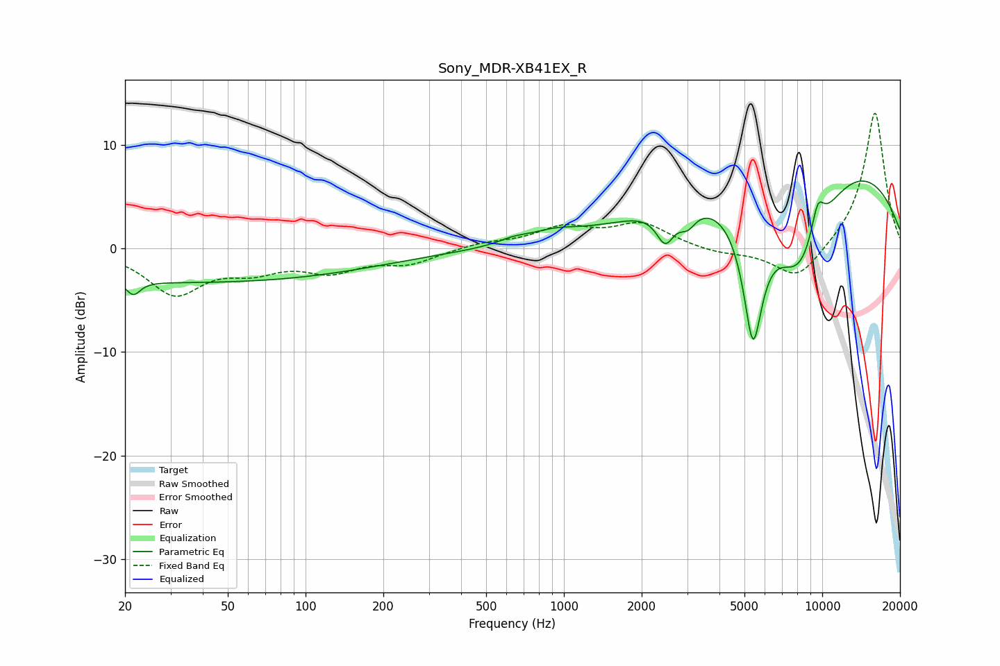

# Sony_MDR-XB41EX_R
See [usage instructions](https://github.com/jaakkopasanen/AutoEq#usage) for more options and info.

### Parametric EQs
Apply preamp of -6.6 dB when using parametric equalizer.

|   # | Type    |   Fc (Hz) |    Q |   Gain (dB) |
|-----|---------|-----------|------|-------------|
|   1 | Peaking |        22 | 5.51 |        -1.3 |
|   2 | Peaking |        36 | 0.18 |        -3.2 |
|   3 | Peaking |       636 | 2.47 |         0.5 |
|   4 | Peaking |       910 | 1.49 |         0.9 |
|   5 | Peaking |      2468 | 4.1  |        -3.1 |
|   6 | Peaking |      3009 | 4.32 |        -1.6 |
|   7 | Peaking |      5394 | 3.42 |       -12.7 |
|   8 | Peaking |      8144 | 0.96 |       -12.7 |
|   9 | Peaking |      8935 | 0.28 |        12.2 |
|  10 | Peaking |      9603 | 4.78 |         3.1 |

### Fixed Band EQs
When using fixed band (also called graphic) equalizer, apply preamp of **-13.2 dB** (if available) and set gains manually with these parameters.

|   # | Type    |   Fc (Hz) |    Q |   Gain (dB) |
|-----|---------|-----------|------|-------------|
|   1 | Peaking |        31 | 1.41 |        -4.2 |
|   2 | Peaking |        62 | 1.41 |        -1.7 |
|   3 | Peaking |       125 | 1.41 |        -1.9 |
|   4 | Peaking |       250 | 1.41 |        -1.3 |
|   5 | Peaking |       500 | 1.41 |         0.5 |
|   6 | Peaking |      1000 | 1.41 |         1.9 |
|   7 | Peaking |      2000 | 1.41 |         2.3 |
|   8 | Peaking |      4000 | 1.41 |        -0.5 |
|   9 | Peaking |      8000 | 1.41 |        -3.2 |
|  10 | Peaking |     16000 | 1.41 |        13.4 |

### Graphs

