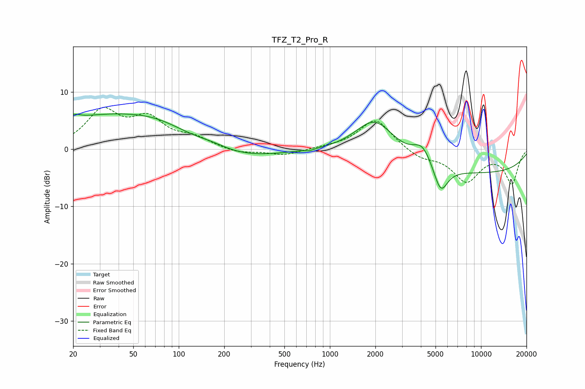

# TFZ_T2_Pro_R
See [usage instructions](https://github.com/jaakkopasanen/AutoEq#usage) for more options and info.

### Parametric EQs
Apply preamp of -6.2 dB when using parametric equalizer.

|   # | Type    |   Fc (Hz) |    Q |   Gain (dB) |
|-----|---------|-----------|------|-------------|
|   1 | Peaking |        20 | 3.54 |         0.9 |
|   2 | Peaking |        32 | 0.35 |         5.5 |
|   3 | Peaking |        72 | 0.77 |         1.5 |
|   4 | Peaking |       167 | 1.6  |         0.5 |
|   5 | Peaking |       275 | 0.6  |        -1.5 |
|   6 | Peaking |       733 | 5.95 |        -0.3 |
|   7 | Peaking |      1987 | 1    |         7.4 |
|   8 | Peaking |      4095 | 2.21 |         3.4 |
|   9 | Peaking |      5408 | 2.97 |        -4.8 |
|  10 | Peaking |      7655 | 0.18 |        -4.3 |

### Fixed Band EQs
When using fixed band (also called graphic) equalizer, apply preamp of **-7.4 dB** (if available) and set gains manually with these parameters.

|   # | Type    |   Fc (Hz) |    Q |   Gain (dB) |
|-----|---------|-----------|------|-------------|
|   1 | Peaking |        31 | 1.41 |         6.3 |
|   2 | Peaking |        62 | 1.41 |         4.7 |
|   3 | Peaking |       125 | 1.41 |         1.7 |
|   4 | Peaking |       250 | 1.41 |        -0.8 |
|   5 | Peaking |       500 | 1.41 |        -1.1 |
|   6 | Peaking |      1000 | 1.41 |         0.2 |
|   7 | Peaking |      2000 | 1.41 |         5.3 |
|   8 | Peaking |      4000 | 1.41 |        -1.5 |
|   9 | Peaking |      8000 | 1.41 |        -5.4 |
|  10 | Peaking |     16000 | 1.41 |        -5.9 |

### Graphs

