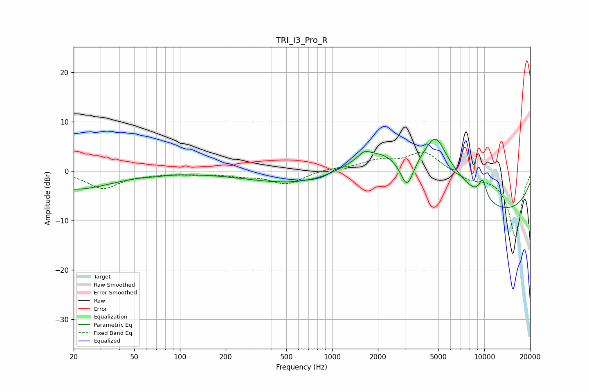

# TRI_I3_Pro_R
See [usage instructions](https://github.com/jaakkopasanen/AutoEq#usage) for more options and info.

### Parametric EQs
Apply preamp of -6.5 dB when using parametric equalizer.

|   # | Type    |   Fc (Hz) |    Q |   Gain (dB) |
|-----|---------|-----------|------|-------------|
|   1 | Peaking |        20 | 0.57 |        -3.7 |
|   2 | Peaking |        70 | 4.57 |        -0.2 |
|   3 | Peaking |       683 | 0.4  |        -3   |
|   4 | Peaking |      1628 | 4.15 |         1.1 |
|   5 | Peaking |      1886 | 0.7  |         6   |
|   6 | Peaking |      3107 | 3.06 |        -6.6 |
|   7 | Peaking |      4787 | 2.33 |         4.7 |
|   8 | Peaking |      4832 | 0.62 |         9.7 |
|   9 | Peaking |      9325 | 0.22 |       -10.2 |
|  10 | Peaking |      9751 | 5.08 |         3.7 |

### Fixed Band EQs
When using fixed band (also called graphic) equalizer, apply preamp of **-3.9 dB** (if available) and set gains manually with these parameters.

|   # | Type    |   Fc (Hz) |    Q |   Gain (dB) |
|-----|---------|-----------|------|-------------|
|   1 | Peaking |        31 | 1.41 |        -3.5 |
|   2 | Peaking |        62 | 1.41 |        -0.4 |
|   3 | Peaking |       125 | 1.41 |        -0.5 |
|   4 | Peaking |       250 | 1.41 |        -0.8 |
|   5 | Peaking |       500 | 1.41 |        -2.6 |
|   6 | Peaking |      1000 | 1.41 |         0.5 |
|   7 | Peaking |      2000 | 1.41 |         1.8 |
|   8 | Peaking |      4000 | 1.41 |         3.9 |
|   9 | Peaking |      8000 | 1.41 |        -1.6 |
|  10 | Peaking |     16000 | 1.41 |       -13.5 |

### Graphs

