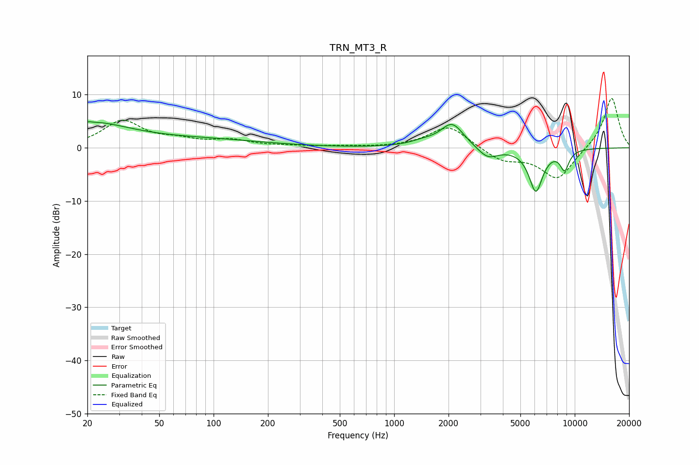

# TRN_MT3_R
See [usage instructions](https://github.com/jaakkopasanen/AutoEq#usage) for more options and info.

### Parametric EQs
Apply preamp of -5.0 dB when using parametric equalizer.

|   # | Type    |   Fc (Hz) |    Q |   Gain (dB) |
|-----|---------|-----------|------|-------------|
|   1 | Peaking |        20 | 0.58 |         4.2 |
|   2 | Peaking |        21 | 5.93 |         3.2 |
|   3 | Peaking |        21 | 5.84 |        -3.2 |
|   4 | Peaking |        21 | 1.04 |         0.3 |
|   5 | Peaking |        94 | 0.42 |         1.3 |
|   6 | Peaking |      1444 | 1.84 |         0.8 |
|   7 | Peaking |      2095 | 2.22 |         4.5 |
|   8 | Peaking |      3297 | 2.52 |        -2.1 |
|   9 | Peaking |      6092 | 3.56 |        -8   |
|  10 | Peaking |      8788 | 5.2  |        -3.6 |

### Fixed Band EQs
When using fixed band (also called graphic) equalizer, apply preamp of **-9.4 dB** (if available) and set gains manually with these parameters.

|   # | Type    |   Fc (Hz) |    Q |   Gain (dB) |
|-----|---------|-----------|------|-------------|
|   1 | Peaking |        31 | 1.41 |         4.9 |
|   2 | Peaking |        62 | 1.41 |         1.2 |
|   3 | Peaking |       125 | 1.41 |         1.3 |
|   4 | Peaking |       250 | 1.41 |         0.2 |
|   5 | Peaking |       500 | 1.41 |         0.2 |
|   6 | Peaking |      1000 | 1.41 |         0   |
|   7 | Peaking |      2000 | 1.41 |         4.2 |
|   8 | Peaking |      4000 | 1.41 |        -2.4 |
|   9 | Peaking |      8000 | 1.41 |        -5.9 |
|  10 | Peaking |     16000 | 1.41 |         9.7 |

### Graphs

