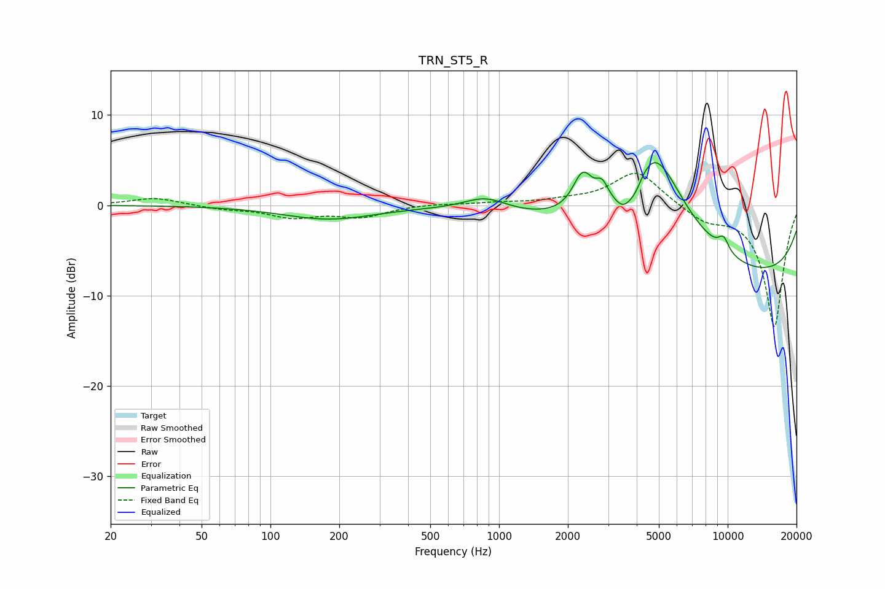

# TRN_ST5_R
See [usage instructions](https://github.com/jaakkopasanen/AutoEq#usage) for more options and info.

### Parametric EQs
Apply preamp of -4.8 dB when using parametric equalizer.

|   # | Type    |   Fc (Hz) |    Q |   Gain (dB) |
|-----|---------|-----------|------|-------------|
|   1 | Peaking |       180 | 0.7  |        -1.5 |
|   2 | Peaking |       870 | 1.52 |         1.5 |
|   3 | Peaking |      2322 | 3.26 |         4.1 |
|   4 | Peaking |      2821 | 5.33 |         1.8 |
|   5 | Peaking |      3504 | 3.18 |        -2.4 |
|   6 | Peaking |      3946 | 3.43 |        -0.8 |
|   7 | Peaking |      3959 | 4.29 |        -0.8 |
|   8 | Peaking |      4740 | 0.95 |        12.7 |
|   9 | Peaking |      9590 | 5.35 |         1.5 |
|  10 | Peaking |      9855 | 0.18 |        -8.4 |

### Fixed Band EQs
When using fixed band (also called graphic) equalizer, apply preamp of **-3.6 dB** (if available) and set gains manually with these parameters.

|   # | Type    |   Fc (Hz) |    Q |   Gain (dB) |
|-----|---------|-----------|------|-------------|
|   1 | Peaking |        31 | 1.41 |         0.8 |
|   2 | Peaking |        62 | 1.41 |        -0.4 |
|   3 | Peaking |       125 | 1.41 |        -1.2 |
|   4 | Peaking |       250 | 1.41 |        -1.2 |
|   5 | Peaking |       500 | 1.41 |         0.2 |
|   6 | Peaking |      1000 | 1.41 |         0.2 |
|   7 | Peaking |      2000 | 1.41 |         0.4 |
|   8 | Peaking |      4000 | 1.41 |         3.8 |
|   9 | Peaking |      8000 | 1.41 |        -1.5 |
|  10 | Peaking |     16000 | 1.41 |       -13.5 |

### Graphs

