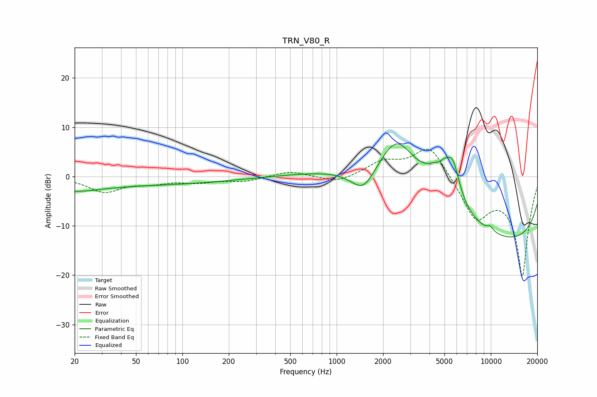

# TRN_V80_R
See [usage instructions](https://github.com/jaakkopasanen/AutoEq#usage) for more options and info.

### Parametric EQs
Apply preamp of -6.7 dB when using parametric equalizer.

|   # | Type    |   Fc (Hz) |    Q |   Gain (dB) |
|-----|---------|-----------|------|-------------|
|   1 | Peaking |        20 | 0.9  |        -1.4 |
|   2 | Peaking |        39 | 0.18 |        -1.7 |
|   3 | Peaking |      1494 | 1.7  |        -5.4 |
|   4 | Peaking |      2454 | 1.03 |        11.2 |
|   5 | Peaking |      3634 | 0.21 |         4.5 |
|   6 | Peaking |      4632 | 5.95 |        -0.9 |
|   7 | Peaking |      4797 | 1.79 |         6.9 |
|   8 | Peaking |      5687 | 3.19 |         6   |
|   9 | Peaking |      9915 | 5.79 |         1   |
|  10 | Peaking |     10000 | 0.19 |       -15.6 |

### Fixed Band EQs
When using fixed band (also called graphic) equalizer, apply preamp of **-5.6 dB** (if available) and set gains manually with these parameters.

|   # | Type    |   Fc (Hz) |    Q |   Gain (dB) |
|-----|---------|-----------|------|-------------|
|   1 | Peaking |        31 | 1.41 |        -3   |
|   2 | Peaking |        62 | 1.41 |        -1.1 |
|   3 | Peaking |       125 | 1.41 |        -1   |
|   4 | Peaking |       250 | 1.41 |        -0.9 |
|   5 | Peaking |       500 | 1.41 |         1.2 |
|   6 | Peaking |      1000 | 1.41 |        -1.4 |
|   7 | Peaking |      2000 | 1.41 |         2.8 |
|   8 | Peaking |      4000 | 1.41 |         6.6 |
|   9 | Peaking |      8000 | 1.41 |        -7.9 |
|  10 | Peaking |     16000 | 1.41 |       -20   |

### Graphs

