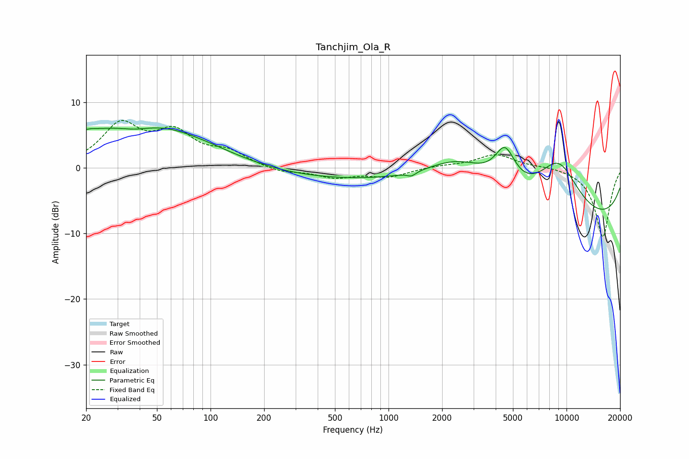

# Tanchjim_Ola_R
See [usage instructions](https://github.com/jaakkopasanen/AutoEq#usage) for more options and info.

### Parametric EQs
Apply preamp of -6.2 dB when using parametric equalizer.

|   # | Type    |   Fc (Hz) |    Q |   Gain (dB) |
|-----|---------|-----------|------|-------------|
|   1 | Peaking |        20 | 2.73 |         0.7 |
|   2 | Peaking |        20 | 0.18 |         0.8 |
|   3 | Peaking |        38 | 1.43 |        -1.1 |
|   4 | Peaking |        41 | 0.38 |         6.4 |
|   5 | Peaking |       611 | 0.24 |        -1.8 |
|   6 | Peaking |      1346 | 5.73 |        -0.6 |
|   7 | Peaking |      2514 | 0.68 |         6   |
|   8 | Peaking |      4510 | 2.39 |         5.6 |
|   9 | Peaking |      8996 | 1    |         8.6 |
|  10 | Peaking |     10000 | 0.18 |        -9   |

### Fixed Band EQs
When using fixed band (also called graphic) equalizer, apply preamp of **-7.3 dB** (if available) and set gains manually with these parameters.

|   # | Type    |   Fc (Hz) |    Q |   Gain (dB) |
|-----|---------|-----------|------|-------------|
|   1 | Peaking |        31 | 1.41 |         6.2 |
|   2 | Peaking |        62 | 1.41 |         4.8 |
|   3 | Peaking |       125 | 1.41 |         2.1 |
|   4 | Peaking |       250 | 1.41 |        -0.8 |
|   5 | Peaking |       500 | 1.41 |        -1.4 |
|   6 | Peaking |      1000 | 1.41 |        -1.3 |
|   7 | Peaking |      2000 | 1.41 |         0.3 |
|   8 | Peaking |      4000 | 1.41 |         2.1 |
|   9 | Peaking |      8000 | 1.41 |         0.3 |
|  10 | Peaking |     16000 | 1.41 |       -10.6 |

### Graphs

