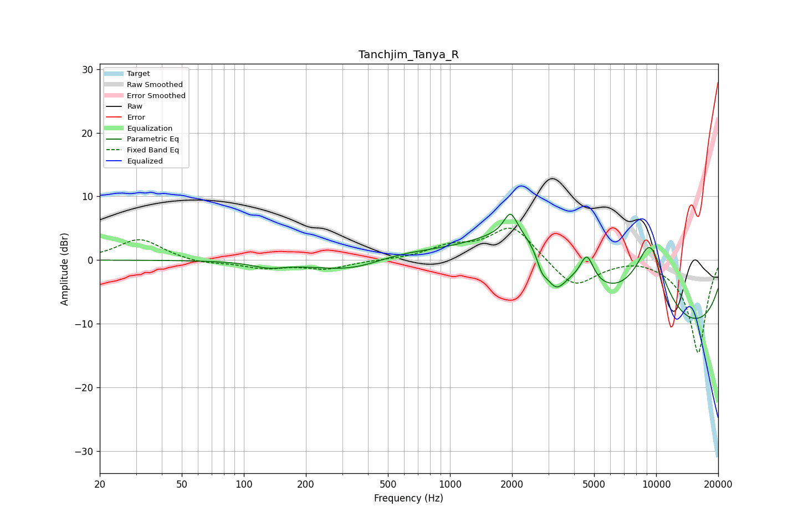

# Tanchjim_Tanya_R
See [usage instructions](https://github.com/jaakkopasanen/AutoEq#usage) for more options and info.

### Parametric EQs
Apply preamp of -7.3 dB when using parametric equalizer.

|   # | Type    |   Fc (Hz) |    Q |   Gain (dB) |
|-----|---------|-----------|------|-------------|
|   1 | Peaking |       132 | 1.84 |        -0.8 |
|   2 | Peaking |       365 | 0.72 |        -2.8 |
|   3 | Peaking |       507 | 0.76 |         1.9 |
|   4 | Peaking |      1965 | 4.54 |         3.4 |
|   5 | Peaking |      2383 | 0.58 |        10.9 |
|   6 | Peaking |      2790 | 5.73 |        -2.2 |
|   7 | Peaking |      3240 | 2.59 |        -5.4 |
|   8 | Peaking |      4615 | 4.31 |         4.3 |
|   9 | Peaking |      9330 | 1.44 |        13   |
|  10 | Peaking |      9870 | 0.18 |       -12.8 |

### Fixed Band EQs
When using fixed band (also called graphic) equalizer, apply preamp of **-5.1 dB** (if available) and set gains manually with these parameters.

|   # | Type    |   Fc (Hz) |    Q |   Gain (dB) |
|-----|---------|-----------|------|-------------|
|   1 | Peaking |        31 | 1.41 |         3.4 |
|   2 | Peaking |        62 | 1.41 |        -0.6 |
|   3 | Peaking |       125 | 1.41 |        -1.2 |
|   4 | Peaking |       250 | 1.41 |        -1.3 |
|   5 | Peaking |       500 | 1.41 |        -0   |
|   6 | Peaking |      1000 | 1.41 |         1.9 |
|   7 | Peaking |      2000 | 1.41 |         5.5 |
|   8 | Peaking |      4000 | 1.41 |        -4.5 |
|   9 | Peaking |      8000 | 1.41 |         0.6 |
|  10 | Peaking |     16000 | 1.41 |       -14.7 |

### Graphs

