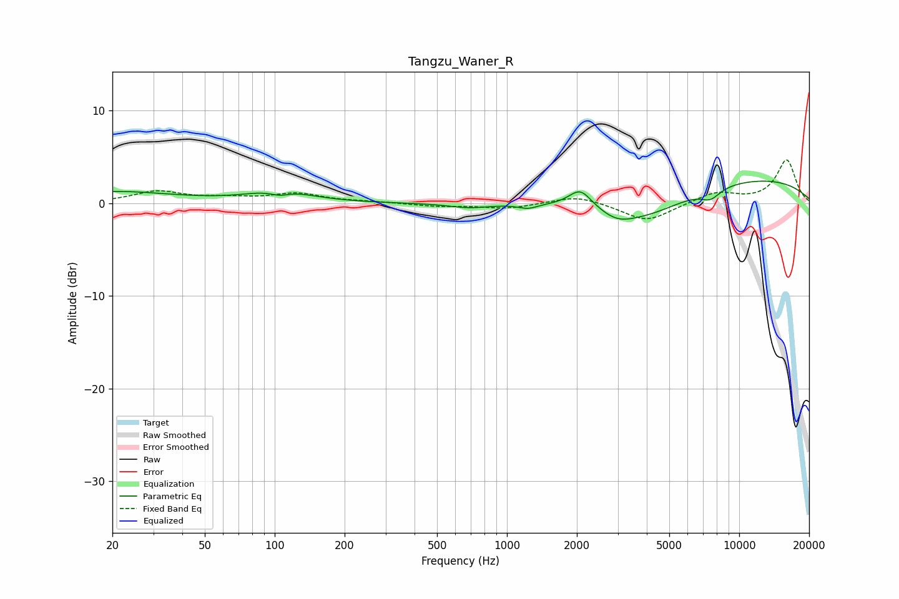

# Tangzu_Waner_R
See [usage instructions](https://github.com/jaakkopasanen/AutoEq#usage) for more options and info.

### Parametric EQs
Apply preamp of -2.5 dB when using parametric equalizer.

|   # | Type    |   Fc (Hz) |    Q |   Gain (dB) |
|-----|---------|-----------|------|-------------|
|   1 | Peaking |        20 | 0.54 |         1.2 |
|   2 | Peaking |       105 | 3.1  |        -0.6 |
|   3 | Peaking |       105 | 1.13 |         1.4 |
|   4 | Peaking |       688 | 1.61 |        -0.5 |
|   5 | Peaking |      1234 | 3.49 |        -0.5 |
|   6 | Peaking |      2069 | 2.91 |         2   |
|   7 | Peaking |      2982 | 1.91 |        -1.1 |
|   8 | Peaking |      3988 | 0.77 |        -2.8 |
|   9 | Peaking |      7525 | 3.13 |        -1.1 |
|  10 | Peaking |     10000 | 0.27 |         2.8 |

### Fixed Band EQs
When using fixed band (also called graphic) equalizer, apply preamp of **-4.8 dB** (if available) and set gains manually with these parameters.

|   # | Type    |   Fc (Hz) |    Q |   Gain (dB) |
|-----|---------|-----------|------|-------------|
|   1 | Peaking |        31 | 1.41 |         1.2 |
|   2 | Peaking |        62 | 1.41 |         0.5 |
|   3 | Peaking |       125 | 1.41 |         1   |
|   4 | Peaking |       250 | 1.41 |         0.1 |
|   5 | Peaking |       500 | 1.41 |        -0.3 |
|   6 | Peaking |      1000 | 1.41 |        -0.6 |
|   7 | Peaking |      2000 | 1.41 |         0.9 |
|   8 | Peaking |      4000 | 1.41 |        -2   |
|   9 | Peaking |      8000 | 1.41 |         1.2 |
|  10 | Peaking |     16000 | 1.41 |         4.7 |

### Graphs

