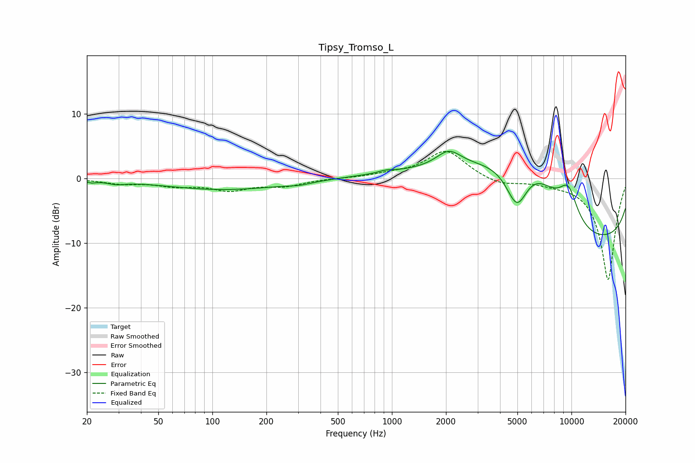

# Tipsy_Tromso_L
See [usage instructions](https://github.com/jaakkopasanen/AutoEq#usage) for more options and info.

### Parametric EQs
Apply preamp of -4.3 dB when using parametric equalizer.

|   # | Type    |   Fc (Hz) |    Q |   Gain (dB) |
|-----|---------|-----------|------|-------------|
|   1 | Peaking |        21 | 5.72 |        -0.3 |
|   2 | Peaking |        29 | 2.89 |        -0.5 |
|   3 | Peaking |       117 | 0.41 |        -1.7 |
|   4 | Peaking |       305 | 2.13 |        -0.3 |
|   5 | Peaking |       928 | 3.61 |         0.3 |
|   6 | Peaking |      2075 | 2.04 |         2.6 |
|   7 | Peaking |      4982 | 2    |        -8.6 |
|   8 | Peaking |      5567 | 0.4  |        19.8 |
|   9 | Peaking |      9618 | 2.4  |         4.8 |
|  10 | Peaking |      9816 | 0.23 |       -19   |

### Fixed Band EQs
When using fixed band (also called graphic) equalizer, apply preamp of **-4.3 dB** (if available) and set gains manually with these parameters.

|   # | Type    |   Fc (Hz) |    Q |   Gain (dB) |
|-----|---------|-----------|------|-------------|
|   1 | Peaking |        31 | 1.41 |        -0.7 |
|   2 | Peaking |        62 | 1.41 |        -1   |
|   3 | Peaking |       125 | 1.41 |        -1.6 |
|   4 | Peaking |       250 | 1.41 |        -1.1 |
|   5 | Peaking |       500 | 1.41 |         0   |
|   6 | Peaking |      1000 | 1.41 |         0.5 |
|   7 | Peaking |      2000 | 1.41 |         4.3 |
|   8 | Peaking |      4000 | 1.41 |        -1.1 |
|   9 | Peaking |      8000 | 1.41 |        -0.4 |
|  10 | Peaking |     16000 | 1.41 |       -15.7 |

### Graphs

