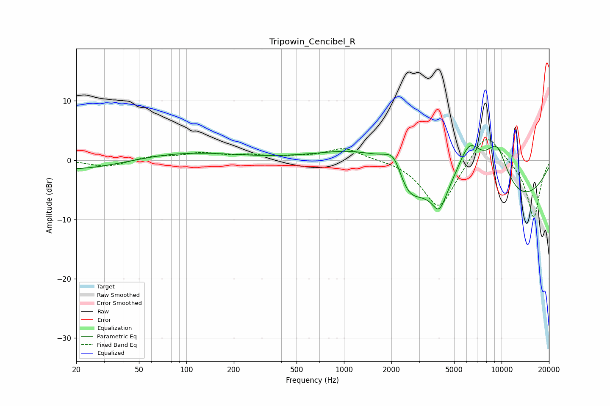

# Tripowin_Cencibel_R
See [usage instructions](https://github.com/jaakkopasanen/AutoEq#usage) for more options and info.

### Parametric EQs
Apply preamp of -2.6 dB when using parametric equalizer.

|   # | Type    |   Fc (Hz) |    Q |   Gain (dB) |
|-----|---------|-----------|------|-------------|
|   1 | Peaking |        20 | 0.43 |        -1.7 |
|   2 | Peaking |        93 | 0.43 |         1.4 |
|   3 | Peaking |      1377 | 0.57 |         4.4 |
|   4 | Peaking |      1911 | 1.6  |         1.6 |
|   5 | Peaking |      2094 | 2.67 |         3.3 |
|   6 | Peaking |      2521 | 1.85 |        -3.8 |
|   7 | Peaking |      4023 | 3.21 |        -3.9 |
|   8 | Peaking |      6228 | 1.44 |         9.8 |
|   9 | Peaking |      6999 | 0.23 |       -10.3 |
|  10 | Peaking |      9322 | 1.52 |         8.9 |

### Fixed Band EQs
When using fixed band (also called graphic) equalizer, apply preamp of **-3.6 dB** (if available) and set gains manually with these parameters.

|   # | Type    |   Fc (Hz) |    Q |   Gain (dB) |
|-----|---------|-----------|------|-------------|
|   1 | Peaking |        31 | 1.41 |        -1.2 |
|   2 | Peaking |        62 | 1.41 |         0.6 |
|   3 | Peaking |       125 | 1.41 |         1.1 |
|   4 | Peaking |       250 | 1.41 |         0.7 |
|   5 | Peaking |       500 | 1.41 |         0.4 |
|   6 | Peaking |      1000 | 1.41 |         2.1 |
|   7 | Peaking |      2000 | 1.41 |         0.2 |
|   8 | Peaking |      4000 | 1.41 |        -8.4 |
|   9 | Peaking |      8000 | 1.41 |         5.3 |
|  10 | Peaking |     16000 | 1.41 |        -9.8 |

### Graphs

