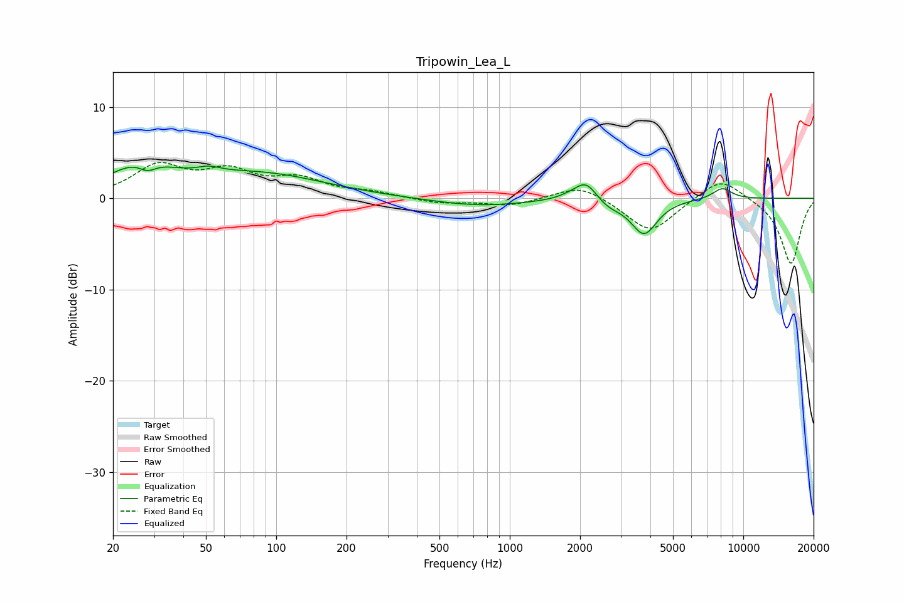

# Tripowin_Lea_L
See [usage instructions](https://github.com/jaakkopasanen/AutoEq#usage) for more options and info.

### Parametric EQs
Apply preamp of -3.6 dB when using parametric equalizer.

|   # | Type    |   Fc (Hz) |    Q |   Gain (dB) |
|-----|---------|-----------|------|-------------|
|   1 | Peaking |        26 | 1.08 |         3.3 |
|   2 | Peaking |        28 | 3.64 |        -1.1 |
|   3 | Peaking |        52 | 2.91 |         0.6 |
|   4 | Peaking |        84 | 0.5  |         2.6 |
|   5 | Peaking |       737 | 0.7  |        -0.8 |
|   6 | Peaking |      1866 | 2.33 |         0.5 |
|   7 | Peaking |      2127 | 3.07 |         1.9 |
|   8 | Peaking |      2659 | 2.65 |        -0.7 |
|   9 | Peaking |      3761 | 2.51 |        -3.8 |
|  10 | Peaking |      8121 | 3.21 |         1.2 |

### Fixed Band EQs
When using fixed band (also called graphic) equalizer, apply preamp of **-4.0 dB** (if available) and set gains manually with these parameters.

|   # | Type    |   Fc (Hz) |    Q |   Gain (dB) |
|-----|---------|-----------|------|-------------|
|   1 | Peaking |        31 | 1.41 |         3.4 |
|   2 | Peaking |        62 | 1.41 |         2.6 |
|   3 | Peaking |       125 | 1.41 |         1.9 |
|   4 | Peaking |       250 | 1.41 |         0.6 |
|   5 | Peaking |       500 | 1.41 |        -0.5 |
|   6 | Peaking |      1000 | 1.41 |        -0.8 |
|   7 | Peaking |      2000 | 1.41 |         1.6 |
|   8 | Peaking |      4000 | 1.41 |        -3.8 |
|   9 | Peaking |      8000 | 1.41 |         2.5 |
|  10 | Peaking |     16000 | 1.41 |        -7.2 |

### Graphs

