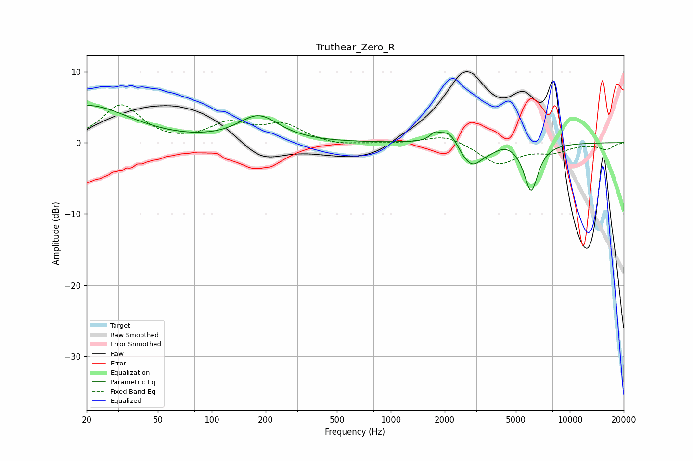

# Truthear_Zero_R
See [usage instructions](https://github.com/jaakkopasanen/AutoEq#usage) for more options and info.

### Parametric EQs
Apply preamp of -5.3 dB when using parametric equalizer.

|   # | Type    |   Fc (Hz) |    Q |   Gain (dB) |
|-----|---------|-----------|------|-------------|
|   1 | Peaking |        20 | 0.6  |         5.2 |
|   2 | Peaking |       183 | 1.26 |         3.6 |
|   3 | Peaking |      1756 | 5.97 |         0.8 |
|   4 | Peaking |      2111 | 2.48 |         2.3 |
|   5 | Peaking |      2526 | 3.75 |        -0.6 |
|   6 | Peaking |      2654 | 1.84 |        -0.4 |
|   7 | Peaking |      2856 | 2.62 |        -2.7 |
|   8 | Peaking |      3590 | 2.15 |        -0.8 |
|   9 | Peaking |      4331 | 1.9  |         0.8 |
|  10 | Peaking |      6077 | 3.44 |        -6.7 |

### Fixed Band EQs
When using fixed band (also called graphic) equalizer, apply preamp of **-5.4 dB** (if available) and set gains manually with these parameters.

|   # | Type    |   Fc (Hz) |    Q |   Gain (dB) |
|-----|---------|-----------|------|-------------|
|   1 | Peaking |        31 | 1.41 |         5.2 |
|   2 | Peaking |        62 | 1.41 |        -0.2 |
|   3 | Peaking |       125 | 1.41 |         2.5 |
|   4 | Peaking |       250 | 1.41 |         2.4 |
|   5 | Peaking |       500 | 1.41 |        -0.5 |
|   6 | Peaking |      1000 | 1.41 |        -0.1 |
|   7 | Peaking |      2000 | 1.41 |         1.2 |
|   8 | Peaking |      4000 | 1.41 |        -3   |
|   9 | Peaking |      8000 | 1.41 |        -1.1 |
|  10 | Peaking |     16000 | 1.41 |        -0.9 |

### Graphs

