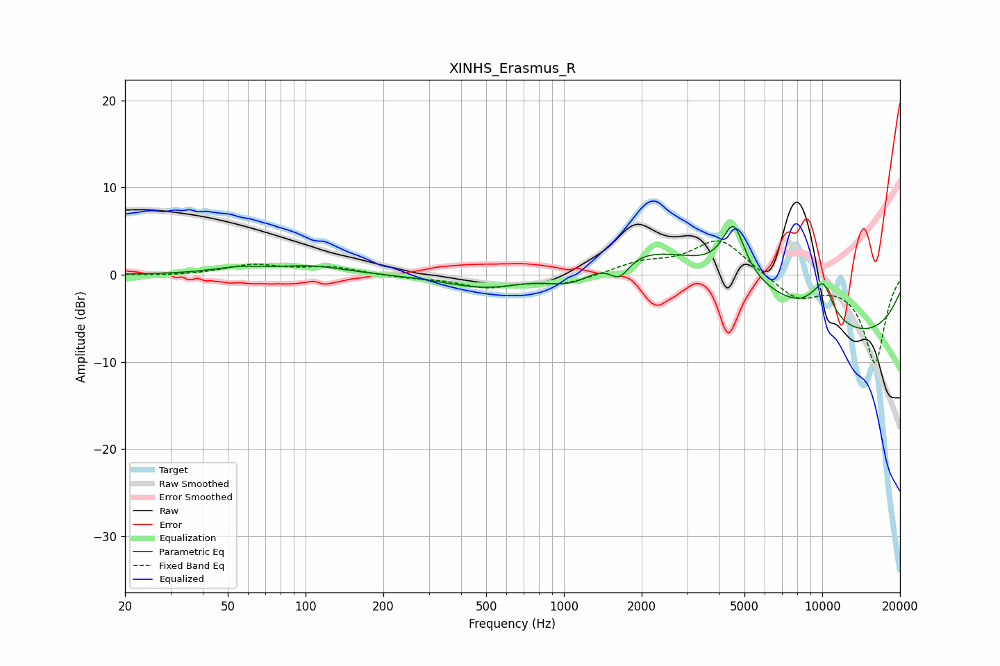

# XINHS_Erasmus_R
See [usage instructions](https://github.com/jaakkopasanen/AutoEq#usage) for more options and info.

### Parametric EQs
Apply preamp of -5.6 dB when using parametric equalizer.

|   # | Type    |   Fc (Hz) |    Q |   Gain (dB) |
|-----|---------|-----------|------|-------------|
|   1 | Peaking |        55 | 1.38 |         0.7 |
|   2 | Peaking |       106 | 1.09 |         0.9 |
|   3 | Peaking |       543 | 0.69 |        -4.2 |
|   4 | Peaking |      1075 | 1.19 |        -3.9 |
|   5 | Peaking |      1641 | 3.6  |        -2.3 |
|   6 | Peaking |      2662 | 0.2  |         8.3 |
|   7 | Peaking |      4537 | 3.21 |         6   |
|   8 | Peaking |      9467 | 0.24 |       -10.1 |
|   9 | Peaking |      9633 | 5.9  |        -0.8 |
|  10 | Peaking |      9934 | 3.02 |         4.9 |

### Fixed Band EQs
When using fixed band (also called graphic) equalizer, apply preamp of **-4.0 dB** (if available) and set gains manually with these parameters.

|   # | Type    |   Fc (Hz) |    Q |   Gain (dB) |
|-----|---------|-----------|------|-------------|
|   1 | Peaking |        31 | 1.41 |        -0.1 |
|   2 | Peaking |        62 | 1.41 |         1.1 |
|   3 | Peaking |       125 | 1.41 |         0.8 |
|   4 | Peaking |       250 | 1.41 |        -0.3 |
|   5 | Peaking |       500 | 1.41 |        -1.4 |
|   6 | Peaking |      1000 | 1.41 |        -1   |
|   7 | Peaking |      2000 | 1.41 |         1.3 |
|   8 | Peaking |      4000 | 1.41 |         4.2 |
|   9 | Peaking |      8000 | 1.41 |        -2.7 |
|  10 | Peaking |     16000 | 1.41 |       -10.1 |

### Graphs

