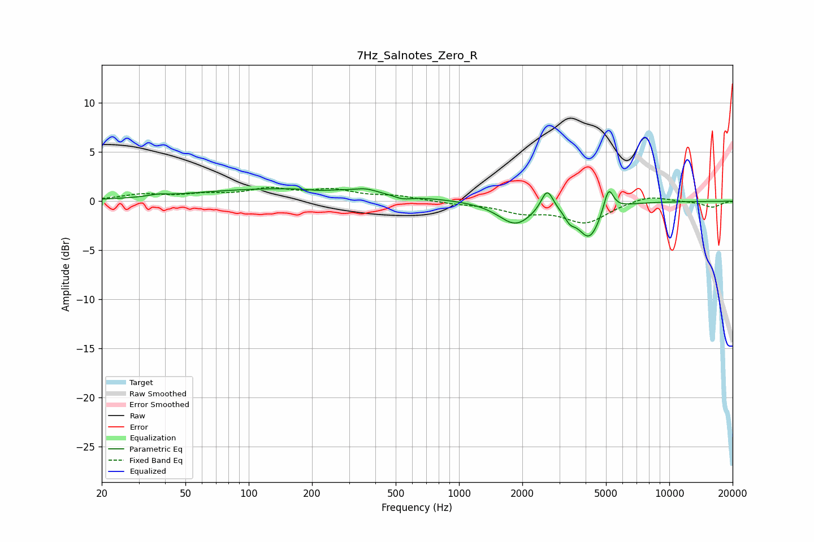

# 7Hz_Salnotes_Zero_R
See [usage instructions](https://github.com/jaakkopasanen/AutoEq#usage) for more options and info.

### Parametric EQs
Apply preamp of -1.4 dB when using parametric equalizer.

|   # | Type    |   Fc (Hz) |    Q |   Gain (dB) |
|-----|---------|-----------|------|-------------|
|   1 | Peaking |        37 | 3.49 |         0.2 |
|   2 | Peaking |       156 | 0.3  |         1.3 |
|   3 | Peaking |       215 | 2.82 |        -0.2 |
|   4 | Peaking |       360 | 2.79 |         0.4 |
|   5 | Peaking |       540 | 3.22 |        -0.4 |
|   6 | Peaking |      1855 | 1.76 |        -2.3 |
|   7 | Peaking |      2626 | 4.97 |         2.2 |
|   8 | Peaking |      3370 | 5.77 |        -0.9 |
|   9 | Peaking |      4165 | 2.6  |        -3.6 |
|  10 | Peaking |      5141 | 6    |         2.5 |

### Fixed Band EQs
When using fixed band (also called graphic) equalizer, apply preamp of **-1.5 dB** (if available) and set gains manually with these parameters.

|   # | Type    |   Fc (Hz) |    Q |   Gain (dB) |
|-----|---------|-----------|------|-------------|
|   1 | Peaking |        31 | 1.41 |         0.6 |
|   2 | Peaking |        62 | 1.41 |         0.5 |
|   3 | Peaking |       125 | 1.41 |         1.1 |
|   4 | Peaking |       250 | 1.41 |         1   |
|   5 | Peaking |       500 | 1.41 |         0.5 |
|   6 | Peaking |      1000 | 1.41 |        -0.2 |
|   7 | Peaking |      2000 | 1.41 |        -1   |
|   8 | Peaking |      4000 | 1.41 |        -2.1 |
|   9 | Peaking |      8000 | 1.41 |         0.7 |
|  10 | Peaking |     16000 | 1.41 |        -0.6 |

### Graphs

