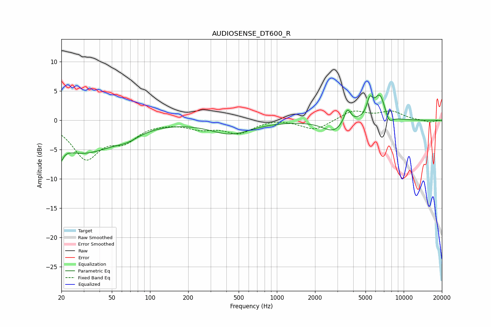

# AUDIOSENSE_DT600_R
See [usage instructions](https://github.com/jaakkopasanen/AutoEq#usage) for more options and info.

### Parametric EQs
Apply preamp of -4.4 dB when using parametric equalizer.

|   # | Type    |   Fc (Hz) |    Q |   Gain (dB) |
|-----|---------|-----------|------|-------------|
|   1 | Peaking |        20 | 5.85 |        -5.6 |
|   2 | Peaking |        20 | 6    |         3.2 |
|   3 | Peaking |        30 | 0.56 |        -5.4 |
|   4 | Peaking |        66 | 1.53 |        -1.1 |
|   5 | Peaking |       432 | 0.88 |        -2.2 |
|   6 | Peaking |      2785 | 1.7  |        -1.9 |
|   7 | Peaking |      3597 | 5.38 |         2.5 |
|   8 | Peaking |      5399 | 6    |         2.7 |
|   9 | Peaking |      6495 | 3.02 |         4.5 |
|  10 | Peaking |      7628 | 4.24 |        -1.7 |

### Fixed Band EQs
When using fixed band (also called graphic) equalizer, apply preamp of **-1.7 dB** (if available) and set gains manually with these parameters.

|   # | Type    |   Fc (Hz) |    Q |   Gain (dB) |
|-----|---------|-----------|------|-------------|
|   1 | Peaking |        31 | 1.41 |        -6.2 |
|   2 | Peaking |        62 | 1.41 |        -3   |
|   3 | Peaking |       125 | 1.41 |        -0.1 |
|   4 | Peaking |       250 | 1.41 |        -1.2 |
|   5 | Peaking |       500 | 1.41 |        -2.1 |
|   6 | Peaking |      1000 | 1.41 |         0.4 |
|   7 | Peaking |      2000 | 1.41 |        -1.7 |
|   8 | Peaking |      4000 | 1.41 |         1.7 |
|   9 | Peaking |      8000 | 1.41 |         1.4 |
|  10 | Peaking |     16000 | 1.41 |        -0.4 |

### Graphs

