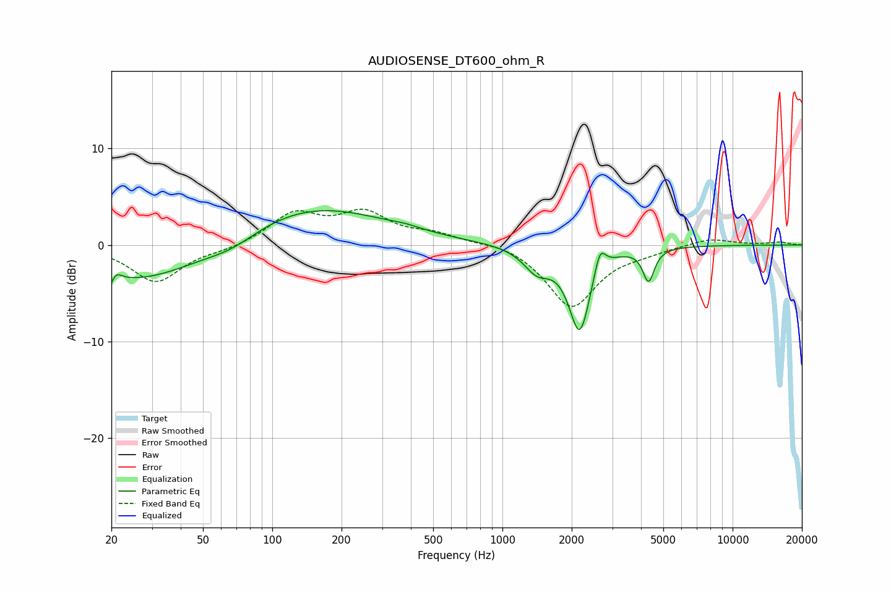

# AUDIOSENSE_DT600_ohm_R
See [usage instructions](https://github.com/jaakkopasanen/AutoEq#usage) for more options and info.

### Parametric EQs
Apply preamp of -3.6 dB when using parametric equalizer.

|   # | Type    |   Fc (Hz) |    Q |   Gain (dB) |
|-----|---------|-----------|------|-------------|
|   1 | Peaking |        20 | 5.78 |        -3.4 |
|   2 | Peaking |        20 | 5.84 |         3   |
|   3 | Peaking |        26 | 0.51 |        -3.9 |
|   4 | Peaking |        67 | 1.22 |        -1.2 |
|   5 | Peaking |       146 | 0.44 |         4.1 |
|   6 | Peaking |       378 | 1.99 |         0.3 |
|   7 | Peaking |      1413 | 2.42 |        -2.3 |
|   8 | Peaking |      2166 | 2.97 |        -8.8 |
|   9 | Peaking |      2650 | 5.84 |         2.7 |
|  10 | Peaking |      4313 | 5.78 |        -3.4 |

### Fixed Band EQs
When using fixed band (also called graphic) equalizer, apply preamp of **-3.8 dB** (if available) and set gains manually with these parameters.

|   # | Type    |   Fc (Hz) |    Q |   Gain (dB) |
|-----|---------|-----------|------|-------------|
|   1 | Peaking |        31 | 1.41 |        -3.8 |
|   2 | Peaking |        62 | 1.41 |        -0.4 |
|   3 | Peaking |       125 | 1.41 |         3.1 |
|   4 | Peaking |       250 | 1.41 |         3   |
|   5 | Peaking |       500 | 1.41 |         1   |
|   6 | Peaking |      1000 | 1.41 |         0.4 |
|   7 | Peaking |      2000 | 1.41 |        -6.4 |
|   8 | Peaking |      4000 | 1.41 |        -0.5 |
|   9 | Peaking |      8000 | 1.41 |         0.7 |
|  10 | Peaking |     16000 | 1.41 |         0.3 |

### Graphs

