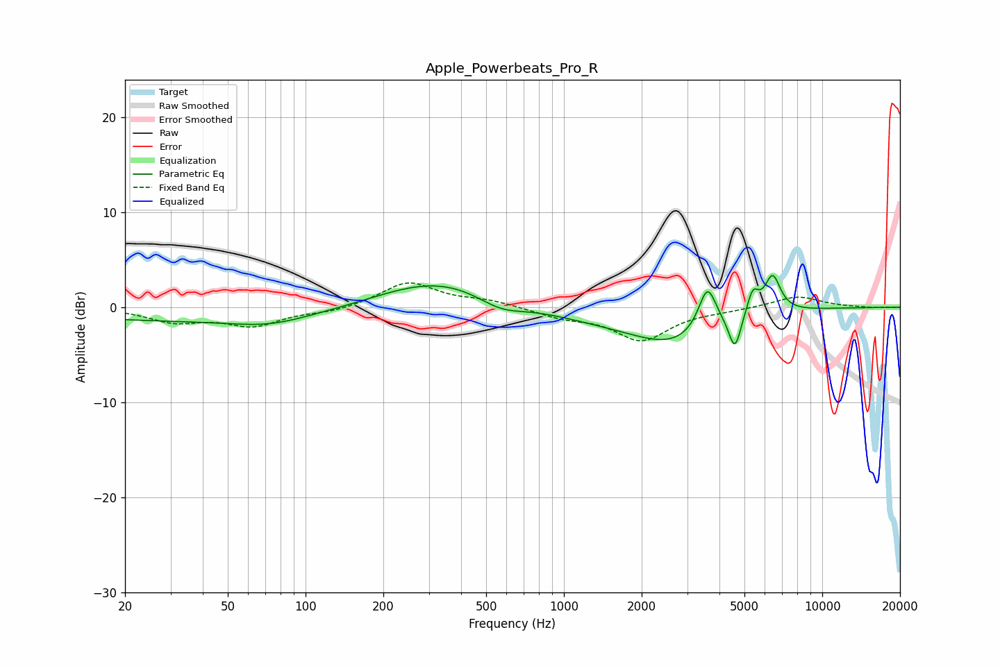

# Apple_Powerbeats_Pro_R
See [usage instructions](https://github.com/jaakkopasanen/AutoEq#usage) for more options and info.

### Parametric EQs
Apply preamp of -3.4 dB when using parametric equalizer.

|   # | Type    |   Fc (Hz) |    Q |   Gain (dB) |
|-----|---------|-----------|------|-------------|
|   1 | Peaking |        40 | 0.21 |        -1.4 |
|   2 | Peaking |        72 | 0.99 |        -0.8 |
|   3 | Peaking |       331 | 0.57 |         3.3 |
|   4 | Peaking |       568 | 1.49 |        -1.5 |
|   5 | Peaking |      1319 | 0.56 |        -1.1 |
|   6 | Peaking |      2688 | 0.84 |        -3.3 |
|   7 | Peaking |      3593 | 4.02 |         4.7 |
|   8 | Peaking |      4591 | 5.98 |        -3.7 |
|   9 | Peaking |      5385 | 5.99 |         2.5 |
|  10 | Peaking |      6426 | 4.52 |         3.9 |

### Fixed Band EQs
When using fixed band (also called graphic) equalizer, apply preamp of **-2.6 dB** (if available) and set gains manually with these parameters.

|   # | Type    |   Fc (Hz) |    Q |   Gain (dB) |
|-----|---------|-----------|------|-------------|
|   1 | Peaking |        31 | 1.41 |        -1.4 |
|   2 | Peaking |        62 | 1.41 |        -1.8 |
|   3 | Peaking |       125 | 1.41 |        -0.5 |
|   4 | Peaking |       250 | 1.41 |         2.6 |
|   5 | Peaking |       500 | 1.41 |         0.6 |
|   6 | Peaking |      1000 | 1.41 |        -0.9 |
|   7 | Peaking |      2000 | 1.41 |        -3.4 |
|   8 | Peaking |      4000 | 1.41 |        -0.2 |
|   9 | Peaking |      8000 | 1.41 |         1.2 |
|  10 | Peaking |     16000 | 1.41 |        -0.1 |

### Graphs

