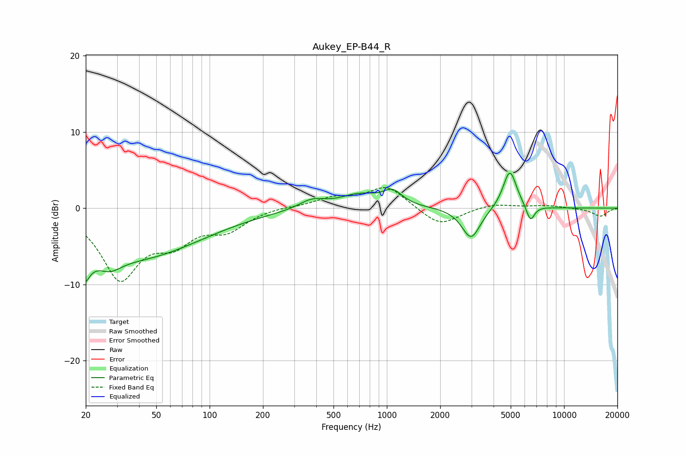

# Aukey_EP-B44_R
See [usage instructions](https://github.com/jaakkopasanen/AutoEq#usage) for more options and info.

### Parametric EQs
Apply preamp of -4.7 dB when using parametric equalizer.

|   # | Type    |   Fc (Hz) |    Q |   Gain (dB) |
|-----|---------|-----------|------|-------------|
|   1 | Peaking |        20 | 4.8  |        -7.4 |
|   2 | Peaking |        20 | 5.72 |         3.3 |
|   3 | Peaking |        27 | 2.01 |        -2.1 |
|   4 | Peaking |        39 | 0.39 |        -6.3 |
|   5 | Peaking |       378 | 1.91 |         1.2 |
|   6 | Peaking |       695 | 1.33 |         1.7 |
|   7 | Peaking |      1077 | 2.52 |         1.9 |
|   8 | Peaking |      2989 | 2.71 |        -4.1 |
|   9 | Peaking |      4943 | 3.62 |         5.1 |
|  10 | Peaking |      6458 | 5.88 |        -2.2 |

### Fixed Band EQs
When using fixed band (also called graphic) equalizer, apply preamp of **-2.8 dB** (if available) and set gains manually with these parameters.

|   # | Type    |   Fc (Hz) |    Q |   Gain (dB) |
|-----|---------|-----------|------|-------------|
|   1 | Peaking |        31 | 1.41 |        -8.9 |
|   2 | Peaking |        62 | 1.41 |        -3.6 |
|   3 | Peaking |       125 | 1.41 |        -2.5 |
|   4 | Peaking |       250 | 1.41 |         0.2 |
|   5 | Peaking |       500 | 1.41 |         1.2 |
|   6 | Peaking |      1000 | 1.41 |         2.9 |
|   7 | Peaking |      2000 | 1.41 |        -2.4 |
|   8 | Peaking |      4000 | 1.41 |         0.6 |
|   9 | Peaking |      8000 | 1.41 |         0.3 |
|  10 | Peaking |     16000 | 1.41 |        -1.1 |

### Graphs

