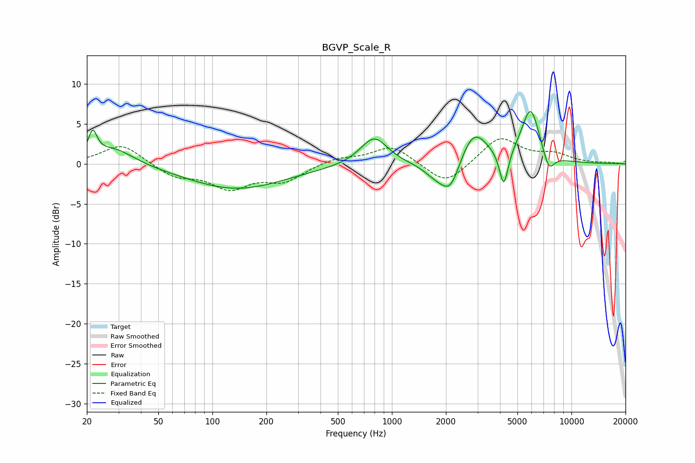

# BGVP_Scale_R
See [usage instructions](https://github.com/jaakkopasanen/AutoEq#usage) for more options and info.

### Parametric EQs
Apply preamp of -6.6 dB when using parametric equalizer.

|   # | Type    |   Fc (Hz) |    Q |   Gain (dB) |
|-----|---------|-----------|------|-------------|
|   1 | Peaking |        22 | 5.95 |         3.1 |
|   2 | Peaking |        28 | 1.26 |         2.1 |
|   3 | Peaking |       136 | 0.52 |        -3.1 |
|   4 | Peaking |       795 | 1.86 |         3.5 |
|   5 | Peaking |      1768 | 1.93 |        -1.6 |
|   6 | Peaking |      2124 | 2.6  |        -3.7 |
|   7 | Peaking |      2846 | 1.83 |         4.4 |
|   8 | Peaking |      4198 | 5.89 |        -4.7 |
|   9 | Peaking |      5918 | 2.66 |         6.8 |
|  10 | Peaking |      7467 | 4.2  |        -2.4 |

### Fixed Band EQs
When using fixed band (also called graphic) equalizer, apply preamp of **-3.2 dB** (if available) and set gains manually with these parameters.

|   # | Type    |   Fc (Hz) |    Q |   Gain (dB) |
|-----|---------|-----------|------|-------------|
|   1 | Peaking |        31 | 1.41 |         2.5 |
|   2 | Peaking |        62 | 1.41 |        -1.6 |
|   3 | Peaking |       125 | 1.41 |        -2.8 |
|   4 | Peaking |       250 | 1.41 |        -2   |
|   5 | Peaking |       500 | 1.41 |         0.8 |
|   6 | Peaking |      1000 | 1.41 |         2.3 |
|   7 | Peaking |      2000 | 1.41 |        -2.8 |
|   8 | Peaking |      4000 | 1.41 |         3.4 |
|   9 | Peaking |      8000 | 1.41 |         1.1 |
|  10 | Peaking |     16000 | 1.41 |         0.1 |

### Graphs

