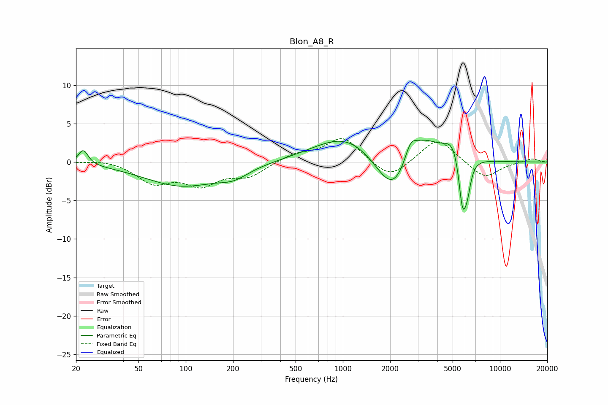

# Blon_A8_R
See [usage instructions](https://github.com/jaakkopasanen/AutoEq#usage) for more options and info.

### Parametric EQs
Apply preamp of -2.9 dB when using parametric equalizer.

|   # | Type    |   Fc (Hz) |    Q |   Gain (dB) |
|-----|---------|-----------|------|-------------|
|   1 | Peaking |        22 | 4.64 |         2   |
|   2 | Peaking |        94 | 0.59 |        -3   |
|   3 | Peaking |       202 | 1.52 |        -1.2 |
|   4 | Peaking |      1075 | 0.68 |         3.8 |
|   5 | Peaking |      2107 | 1.23 |        -6.2 |
|   6 | Peaking |      2693 | 3.62 |         2.5 |
|   7 | Peaking |      3199 | 1.32 |         3.7 |
|   8 | Peaking |      5100 | 2.31 |         2.8 |
|   9 | Peaking |      5775 | 5.44 |        -6.9 |
|  10 | Peaking |      6202 | 6    |        -3   |

### Fixed Band EQs
When using fixed band (also called graphic) equalizer, apply preamp of **-3.1 dB** (if available) and set gains manually with these parameters.

|   # | Type    |   Fc (Hz) |    Q |   Gain (dB) |
|-----|---------|-----------|------|-------------|
|   1 | Peaking |        31 | 1.41 |         0.4 |
|   2 | Peaking |        62 | 1.41 |        -2.5 |
|   3 | Peaking |       125 | 1.41 |        -2.7 |
|   4 | Peaking |       250 | 1.41 |        -1.7 |
|   5 | Peaking |       500 | 1.41 |         1   |
|   6 | Peaking |      1000 | 1.41 |         3.3 |
|   7 | Peaking |      2000 | 1.41 |        -2.4 |
|   8 | Peaking |      4000 | 1.41 |         3.2 |
|   9 | Peaking |      8000 | 1.41 |        -2.2 |
|  10 | Peaking |     16000 | 1.41 |         0.5 |

### Graphs

