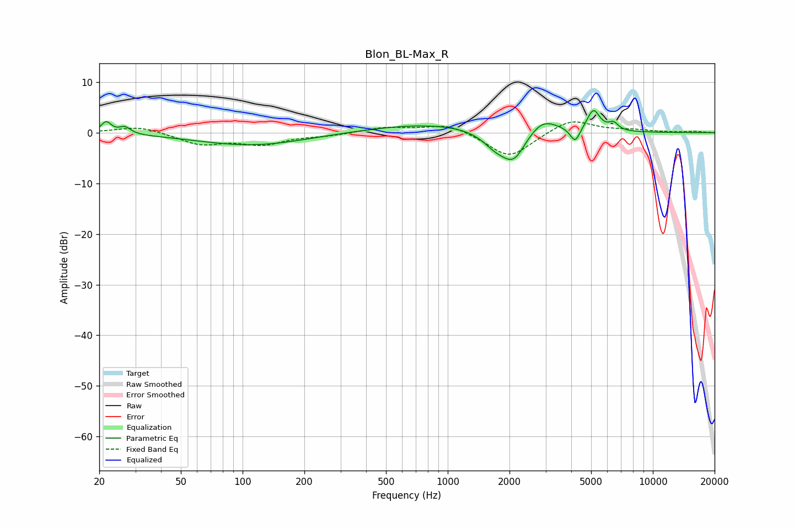

# Blon_BL-Max_R
See [usage instructions](https://github.com/jaakkopasanen/AutoEq#usage) for more options and info.

### Parametric EQs
Apply preamp of -4.4 dB when using parametric equalizer.

|   # | Type    |   Fc (Hz) |    Q |   Gain (dB) |
|-----|---------|-----------|------|-------------|
|   1 | Peaking |        22 | 5.77 |         2.3 |
|   2 | Peaking |        27 | 5.22 |         1.4 |
|   3 | Peaking |       111 | 0.53 |        -2.5 |
|   4 | Peaking |       805 | 0.48 |         1.8 |
|   5 | Peaking |      1705 | 2.22 |        -2.5 |
|   6 | Peaking |      2100 | 2.3  |        -5.8 |
|   7 | Peaking |      2886 | 1.88 |         3.2 |
|   8 | Peaking |      4180 | 6    |        -2.9 |
|   9 | Peaking |      5132 | 4.48 |         4.3 |
|  10 | Peaking |      6427 | 6    |         1.4 |

### Fixed Band EQs
When using fixed band (also called graphic) equalizer, apply preamp of **-2.2 dB** (if available) and set gains manually with these parameters.

|   # | Type    |   Fc (Hz) |    Q |   Gain (dB) |
|-----|---------|-----------|------|-------------|
|   1 | Peaking |        31 | 1.41 |         1.3 |
|   2 | Peaking |        62 | 1.41 |        -2.2 |
|   3 | Peaking |       125 | 1.41 |        -2.1 |
|   4 | Peaking |       250 | 1.41 |        -0.5 |
|   5 | Peaking |       500 | 1.41 |         1   |
|   6 | Peaking |      1000 | 1.41 |         1.8 |
|   7 | Peaking |      2000 | 1.41 |        -5.1 |
|   8 | Peaking |      4000 | 1.41 |         2.8 |
|   9 | Peaking |      8000 | 1.41 |         0.4 |
|  10 | Peaking |     16000 | 1.41 |         0.2 |

### Graphs

