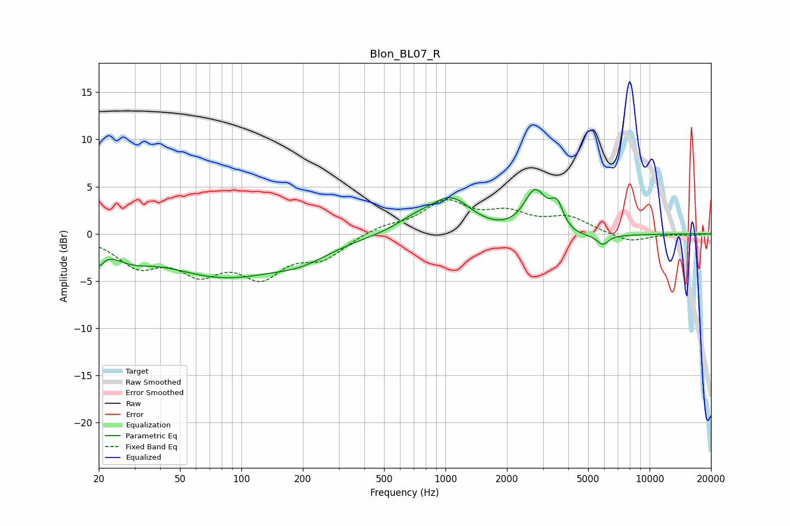

# Blon_BL07_R
See [usage instructions](https://github.com/jaakkopasanen/AutoEq#usage) for more options and info.

### Parametric EQs
Apply preamp of -4.8 dB when using parametric equalizer.

|   # | Type    |   Fc (Hz) |    Q |   Gain (dB) |
|-----|---------|-----------|------|-------------|
|   1 | Peaking |        20 | 5.95 |        -1.7 |
|   2 | Peaking |        29 | 1.44 |        -1.4 |
|   3 | Peaking |        82 | 0.48 |        -4.3 |
|   4 | Peaking |       199 | 1.03 |        -1.3 |
|   5 | Peaking |       710 | 1.46 |         1.1 |
|   6 | Peaking |      1063 | 1.39 |         3.6 |
|   7 | Peaking |      2752 | 2.45 |         5   |
|   8 | Peaking |      3236 | 0.82 |        -1.2 |
|   9 | Peaking |      3517 | 4.33 |         2.7 |
|  10 | Peaking |      5901 | 5.11 |        -1   |

### Fixed Band EQs
When using fixed band (also called graphic) equalizer, apply preamp of **-3.7 dB** (if available) and set gains manually with these parameters.

|   # | Type    |   Fc (Hz) |    Q |   Gain (dB) |
|-----|---------|-----------|------|-------------|
|   1 | Peaking |        31 | 1.41 |        -3   |
|   2 | Peaking |        62 | 1.41 |        -3.5 |
|   3 | Peaking |       125 | 1.41 |        -3.9 |
|   4 | Peaking |       250 | 1.41 |        -2.3 |
|   5 | Peaking |       500 | 1.41 |         0.8 |
|   6 | Peaking |      1000 | 1.41 |         3.2 |
|   7 | Peaking |      2000 | 1.41 |         1.9 |
|   8 | Peaking |      4000 | 1.41 |         1.6 |
|   9 | Peaking |      8000 | 1.41 |        -0.9 |
|  10 | Peaking |     16000 | 1.41 |        -0.1 |

### Graphs

