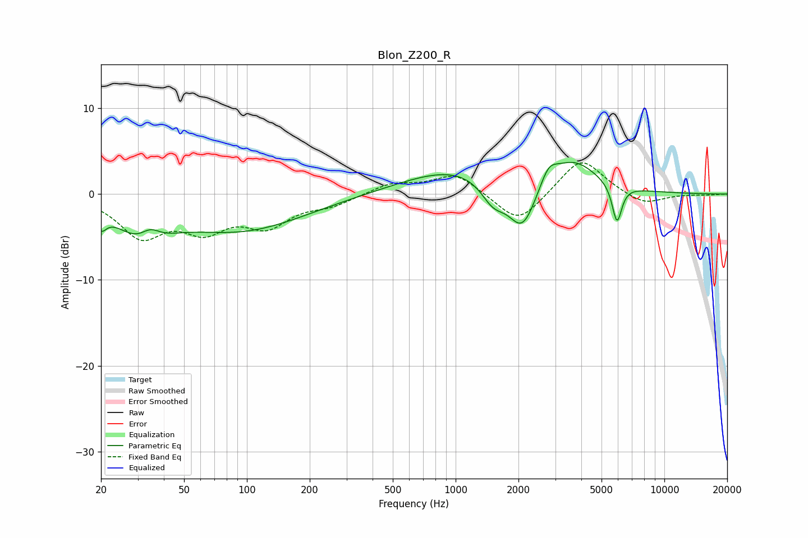

# Blon_Z200_R
See [usage instructions](https://github.com/jaakkopasanen/AutoEq#usage) for more options and info.

### Parametric EQs
Apply preamp of -3.8 dB when using parametric equalizer.

|   # | Type    |   Fc (Hz) |    Q |   Gain (dB) |
|-----|---------|-----------|------|-------------|
|   1 | Peaking |        20 | 5.63 |        -1.8 |
|   2 | Peaking |        32 | 1.18 |        -4.2 |
|   3 | Peaking |        34 | 2.86 |         1.8 |
|   4 | Peaking |        94 | 0.46 |        -4.1 |
|   5 | Peaking |      1038 | 0.54 |         3.1 |
|   6 | Peaking |      1511 | 2.38 |        -2.6 |
|   7 | Peaking |      2089 | 2.04 |        -5.9 |
|   8 | Peaking |      2786 | 3.45 |         2   |
|   9 | Peaking |      3659 | 1.2  |         3.6 |
|  10 | Peaking |      5929 | 6    |        -4.5 |

### Fixed Band EQs
When using fixed band (also called graphic) equalizer, apply preamp of **-3.7 dB** (if available) and set gains manually with these parameters.

|   # | Type    |   Fc (Hz) |    Q |   Gain (dB) |
|-----|---------|-----------|------|-------------|
|   1 | Peaking |        31 | 1.41 |        -4.6 |
|   2 | Peaking |        62 | 1.41 |        -3.6 |
|   3 | Peaking |       125 | 1.41 |        -3.3 |
|   4 | Peaking |       250 | 1.41 |        -1.1 |
|   5 | Peaking |       500 | 1.41 |         1.2 |
|   6 | Peaking |      1000 | 1.41 |         2.4 |
|   7 | Peaking |      2000 | 1.41 |        -3.6 |
|   8 | Peaking |      4000 | 1.41 |         4.4 |
|   9 | Peaking |      8000 | 1.41 |        -1.3 |
|  10 | Peaking |     16000 | 1.41 |        -0.1 |

### Graphs

