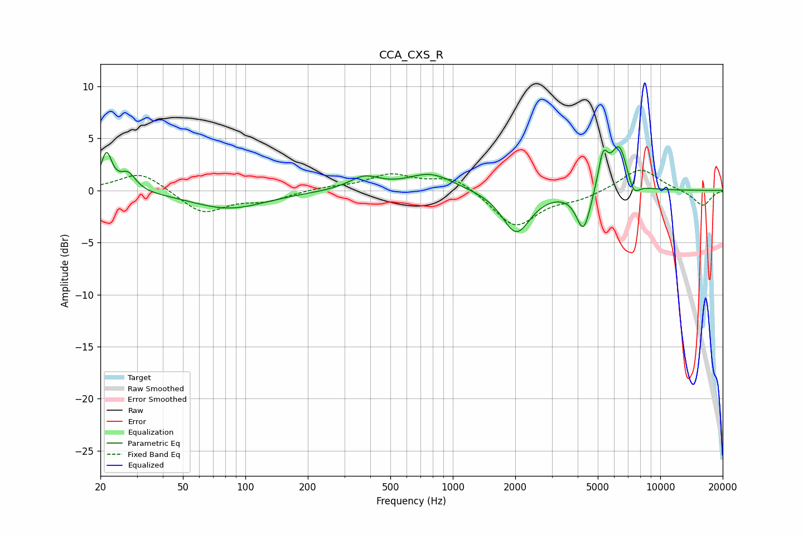

# CCA_CXS_R
See [usage instructions](https://github.com/jaakkopasanen/AutoEq#usage) for more options and info.

### Parametric EQs
Apply preamp of -4.3 dB when using parametric equalizer.

|   # | Type    |   Fc (Hz) |    Q |   Gain (dB) |
|-----|---------|-----------|------|-------------|
|   1 | Peaking |        21 | 5.44 |         3.5 |
|   2 | Peaking |        27 | 3.76 |         1.7 |
|   3 | Peaking |        83 | 0.78 |        -1.7 |
|   4 | Peaking |       374 | 1.91 |         1.2 |
|   5 | Peaking |       780 | 1.28 |         1.6 |
|   6 | Peaking |      2023 | 2.09 |        -4.1 |
|   7 | Peaking |      4267 | 4.04 |        -4   |
|   8 | Peaking |      5299 | 5.78 |         3.3 |
|   9 | Peaking |      6342 | 3.32 |         4.4 |
|  10 | Peaking |      7425 | 4.8  |        -1.5 |

### Fixed Band EQs
When using fixed band (also called graphic) equalizer, apply preamp of **-2.0 dB** (if available) and set gains manually with these parameters.

|   # | Type    |   Fc (Hz) |    Q |   Gain (dB) |
|-----|---------|-----------|------|-------------|
|   1 | Peaking |        31 | 1.41 |         1.8 |
|   2 | Peaking |        62 | 1.41 |        -2.2 |
|   3 | Peaking |       125 | 1.41 |        -0.9 |
|   4 | Peaking |       250 | 1.41 |         0.3 |
|   5 | Peaking |       500 | 1.41 |         1.5 |
|   6 | Peaking |      1000 | 1.41 |         1.4 |
|   7 | Peaking |      2000 | 1.41 |        -3.5 |
|   8 | Peaking |      4000 | 1.41 |        -0.7 |
|   9 | Peaking |      8000 | 1.41 |         2.2 |
|  10 | Peaking |     16000 | 1.41 |        -1.5 |

### Graphs

