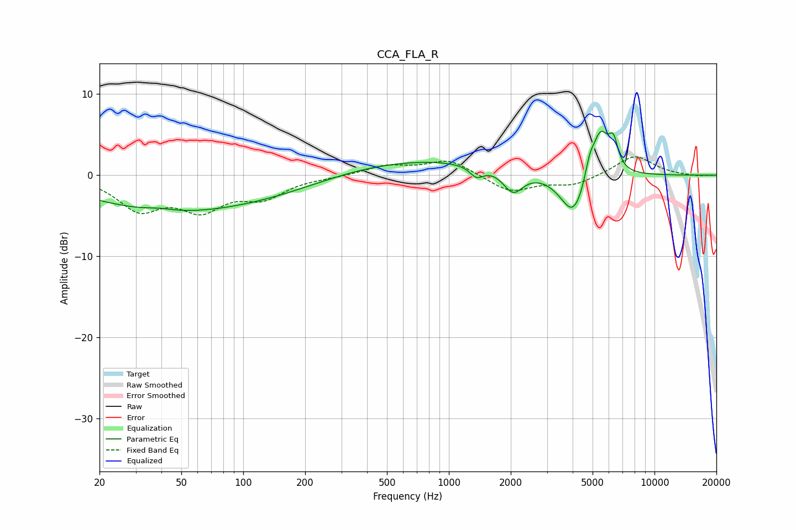

# CCA_FLA_R
See [usage instructions](https://github.com/jaakkopasanen/AutoEq#usage) for more options and info.

### Parametric EQs
Apply preamp of -5.5 dB when using parametric equalizer.

|   # | Type    |   Fc (Hz) |    Q |   Gain (dB) |
|-----|---------|-----------|------|-------------|
|   1 | Peaking |        39 | 2.06 |         0.4 |
|   2 | Peaking |        40 | 0.38 |        -4.1 |
|   3 | Peaking |       146 | 0.48 |        -1.6 |
|   4 | Peaking |       697 | 0.32 |         2   |
|   5 | Peaking |      1364 | 4.29 |        -1.3 |
|   6 | Peaking |      2053 | 2.94 |        -2.8 |
|   7 | Peaking |      4043 | 2.18 |        -5.5 |
|   8 | Peaking |      4839 | 5.96 |         2.2 |
|   9 | Peaking |      5462 | 3.39 |         5.7 |
|  10 | Peaking |      6313 | 6    |         3.2 |

### Fixed Band EQs
When using fixed band (also called graphic) equalizer, apply preamp of **-2.4 dB** (if available) and set gains manually with these parameters.

|   # | Type    |   Fc (Hz) |    Q |   Gain (dB) |
|-----|---------|-----------|------|-------------|
|   1 | Peaking |        31 | 1.41 |        -3.9 |
|   2 | Peaking |        62 | 1.41 |        -3.7 |
|   3 | Peaking |       125 | 1.41 |        -2.4 |
|   4 | Peaking |       250 | 1.41 |        -0.2 |
|   5 | Peaking |       500 | 1.41 |         1.1 |
|   6 | Peaking |      1000 | 1.41 |         1.9 |
|   7 | Peaking |      2000 | 1.41 |        -2.1 |
|   8 | Peaking |      4000 | 1.41 |        -1.2 |
|   9 | Peaking |      8000 | 1.41 |         2.5 |
|  10 | Peaking |     16000 | 1.41 |        -0.1 |

### Graphs

