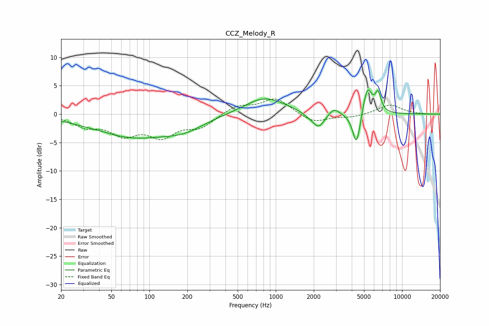

# CCZ_Melody_R
See [usage instructions](https://github.com/jaakkopasanen/AutoEq#usage) for more options and info.

### Parametric EQs
Apply preamp of -4.3 dB when using parametric equalizer.

|   # | Type    |   Fc (Hz) |    Q |   Gain (dB) |
|-----|---------|-----------|------|-------------|
|   1 | Peaking |        43 | 1.47 |         0.2 |
|   2 | Peaking |        73 | 0.44 |        -4   |
|   3 | Peaking |       191 | 0.94 |        -1.6 |
|   4 | Peaking |       821 | 0.88 |         3   |
|   5 | Peaking |      1856 | 2.4  |        -0.6 |
|   6 | Peaking |      2190 | 2.96 |        -2.5 |
|   7 | Peaking |      2891 | 3.4  |         1.2 |
|   8 | Peaking |      4364 | 4.5  |        -6.1 |
|   9 | Peaking |      5315 | 3.84 |         5   |
|  10 | Peaking |      6460 | 6    |         3.2 |

### Fixed Band EQs
When using fixed band (also called graphic) equalizer, apply preamp of **-2.8 dB** (if available) and set gains manually with these parameters.

|   # | Type    |   Fc (Hz) |    Q |   Gain (dB) |
|-----|---------|-----------|------|-------------|
|   1 | Peaking |        31 | 1.41 |        -1.9 |
|   2 | Peaking |        62 | 1.41 |        -3.2 |
|   3 | Peaking |       125 | 1.41 |        -3.5 |
|   4 | Peaking |       250 | 1.41 |        -2.1 |
|   5 | Peaking |       500 | 1.41 |         1.5 |
|   6 | Peaking |      1000 | 1.41 |         2.8 |
|   7 | Peaking |      2000 | 1.41 |        -1.6 |
|   8 | Peaking |      4000 | 1.41 |        -0.5 |
|   9 | Peaking |      8000 | 1.41 |         1.7 |
|  10 | Peaking |     16000 | 1.41 |        -0.1 |

### Graphs

