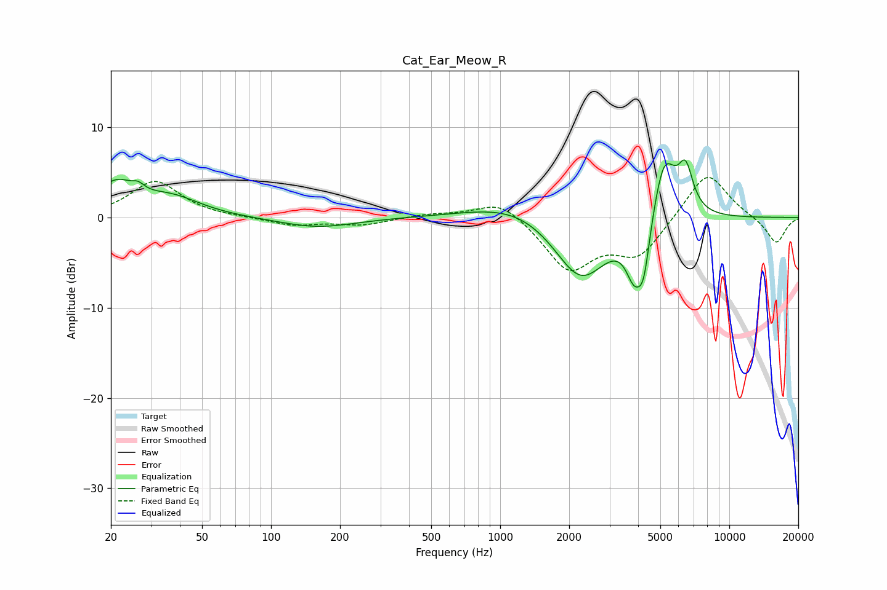

# Cat_Ear_Meow_R
See [usage instructions](https://github.com/jaakkopasanen/AutoEq#usage) for more options and info.

### Parametric EQs
Apply preamp of -6.5 dB when using parametric equalizer.

|   # | Type    |   Fc (Hz) |    Q |   Gain (dB) |
|-----|---------|-----------|------|-------------|
|   1 | Peaking |        21 | 1.73 |         3.4 |
|   2 | Peaking |        26 | 5.63 |         0.7 |
|   3 | Peaking |        37 | 1.1  |         2   |
|   4 | Peaking |       159 | 0.85 |        -1.1 |
|   5 | Peaking |      1221 | 0.7  |         2.1 |
|   6 | Peaking |      2246 | 1.16 |        -7.5 |
|   7 | Peaking |      3836 | 3.77 |        -4.7 |
|   8 | Peaking |      4230 | 4.88 |        -5.4 |
|   9 | Peaking |      5194 | 2.63 |         7.4 |
|  10 | Peaking |      6449 | 4.24 |         4.6 |

### Fixed Band EQs
When using fixed band (also called graphic) equalizer, apply preamp of **-4.5 dB** (if available) and set gains manually with these parameters.

|   # | Type    |   Fc (Hz) |    Q |   Gain (dB) |
|-----|---------|-----------|------|-------------|
|   1 | Peaking |        31 | 1.41 |         4   |
|   2 | Peaking |        62 | 1.41 |        -0   |
|   3 | Peaking |       125 | 1.41 |        -0.9 |
|   4 | Peaking |       250 | 1.41 |        -0.8 |
|   5 | Peaking |       500 | 1.41 |         0.4 |
|   6 | Peaking |      1000 | 1.41 |         2.1 |
|   7 | Peaking |      2000 | 1.41 |        -5.7 |
|   8 | Peaking |      4000 | 1.41 |        -4.1 |
|   9 | Peaking |      8000 | 1.41 |         5.3 |
|  10 | Peaking |     16000 | 1.41 |        -2.9 |

### Graphs

