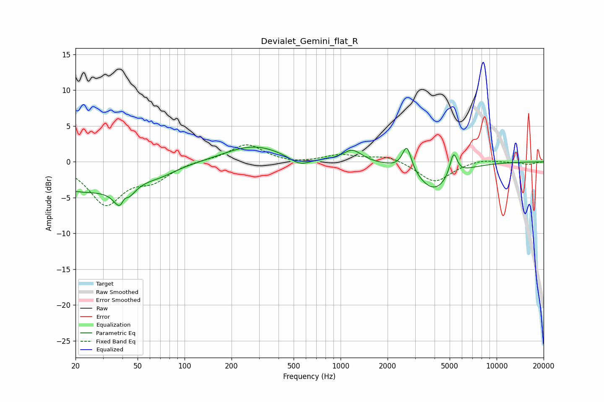

# Devialet_Gemini_flat_R
See [usage instructions](https://github.com/jaakkopasanen/AutoEq#usage) for more options and info.

### Parametric EQs
Apply preamp of -2.2 dB when using parametric equalizer.

|   # | Type    |   Fc (Hz) |    Q |   Gain (dB) |
|-----|---------|-----------|------|-------------|
|   1 | Peaking |        22 | 0.41 |        -4   |
|   2 | Peaking |        40 | 3.4  |        -5.2 |
|   3 | Peaking |        41 | 5.83 |         3   |
|   4 | Peaking |        71 | 1.68 |        -0.5 |
|   5 | Peaking |       276 | 0.74 |         2.3 |
|   6 | Peaking |       548 | 2.11 |        -1.3 |
|   7 | Peaking |      1190 | 2.37 |         1.7 |
|   8 | Peaking |      2659 | 4.9  |         3.5 |
|   9 | Peaking |      3976 | 1.27 |        -4   |
|  10 | Peaking |      5294 | 5.77 |         3.3 |

### Fixed Band EQs
When using fixed band (also called graphic) equalizer, apply preamp of **-2.5 dB** (if available) and set gains manually with these parameters.

|   # | Type    |   Fc (Hz) |    Q |   Gain (dB) |
|-----|---------|-----------|------|-------------|
|   1 | Peaking |        31 | 1.41 |        -5.7 |
|   2 | Peaking |        62 | 1.41 |        -2.2 |
|   3 | Peaking |       125 | 1.41 |         0.2 |
|   4 | Peaking |       250 | 1.41 |         2.5 |
|   5 | Peaking |       500 | 1.41 |        -0.3 |
|   6 | Peaking |      1000 | 1.41 |         0.9 |
|   7 | Peaking |      2000 | 1.41 |         0.9 |
|   8 | Peaking |      4000 | 1.41 |        -2.9 |
|   9 | Peaking |      8000 | 1.41 |         0.4 |
|  10 | Peaking |     16000 | 1.41 |        -0.4 |

### Graphs

