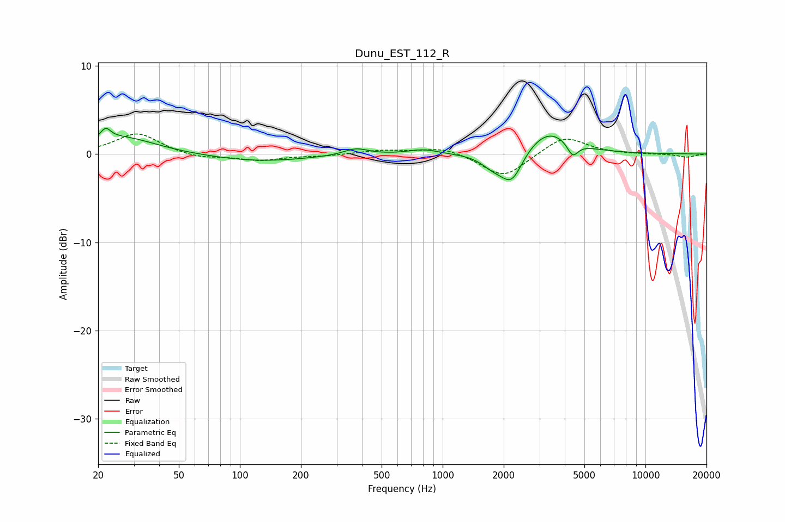

# Dunu_EST_112_R
See [usage instructions](https://github.com/jaakkopasanen/AutoEq#usage) for more options and info.

### Parametric EQs
Apply preamp of -3.0 dB when using parametric equalizer.

|   # | Type    |   Fc (Hz) |    Q |   Gain (dB) |
|-----|---------|-----------|------|-------------|
|   1 | Peaking |        22 | 5.94 |        -1.5 |
|   2 | Peaking |        22 | 5.91 |         2.7 |
|   3 | Peaking |        26 | 0.85 |         1.9 |
|   4 | Peaking |       124 | 0.58 |        -0.8 |
|   5 | Peaking |       373 | 2.38 |         0.8 |
|   6 | Peaking |       802 | 1.93 |         0.5 |
|   7 | Peaking |      1769 | 2.37 |        -1.3 |
|   8 | Peaking |      2191 | 2.6  |        -3.5 |
|   9 | Peaking |      3314 | 1.26 |         2.8 |
|  10 | Peaking |      4374 | 5.21 |        -1.7 |

### Fixed Band EQs
When using fixed band (also called graphic) equalizer, apply preamp of **-2.4 dB** (if available) and set gains manually with these parameters.

|   # | Type    |   Fc (Hz) |    Q |   Gain (dB) |
|-----|---------|-----------|------|-------------|
|   1 | Peaking |        31 | 1.41 |         2.4 |
|   2 | Peaking |        62 | 1.41 |        -0.5 |
|   3 | Peaking |       125 | 1.41 |        -0.7 |
|   4 | Peaking |       250 | 1.41 |        -0.2 |
|   5 | Peaking |       500 | 1.41 |         0.4 |
|   6 | Peaking |      1000 | 1.41 |         0.8 |
|   7 | Peaking |      2000 | 1.41 |        -2.7 |
|   8 | Peaking |      4000 | 1.41 |         2.1 |
|   9 | Peaking |      8000 | 1.41 |        -0   |
|  10 | Peaking |     16000 | 1.41 |        -0.4 |

### Graphs

