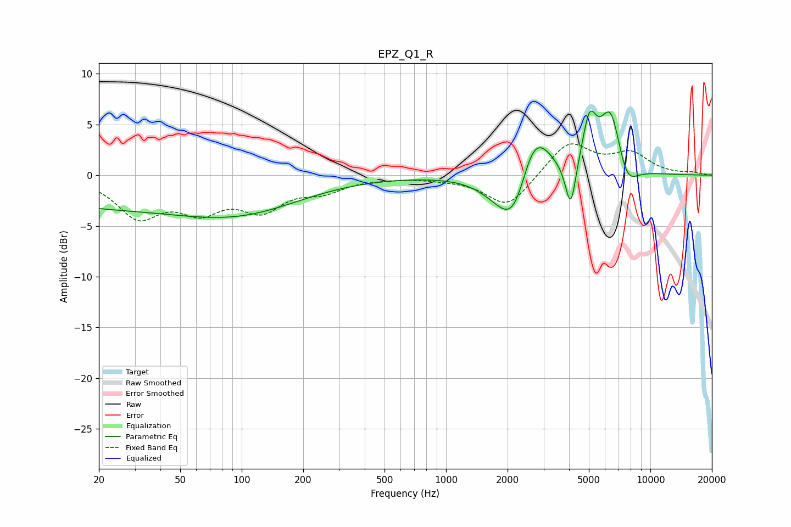

# EPZ_Q1_R
See [usage instructions](https://github.com/jaakkopasanen/AutoEq#usage) for more options and info.

### Parametric EQs
Apply preamp of -6.4 dB when using parametric equalizer.

|   # | Type    |   Fc (Hz) |    Q |   Gain (dB) |
|-----|---------|-----------|------|-------------|
|   1 | Peaking |        30 | 0.18 |        -3.2 |
|   2 | Peaking |       106 | 0.51 |        -1.6 |
|   3 | Peaking |      1798 | 1.47 |        -1.5 |
|   4 | Peaking |      2129 | 2.05 |        -3.8 |
|   5 | Peaking |      2608 | 2.95 |         1.6 |
|   6 | Peaking |      2862 | 1.95 |         3.3 |
|   7 | Peaking |      4074 | 5.44 |        -4.8 |
|   8 | Peaking |      5035 | 4.01 |         4.7 |
|   9 | Peaking |      6398 | 2.56 |         6.5 |
|  10 | Peaking |      7628 | 2.58 |        -2.8 |

### Fixed Band EQs
When using fixed band (also called graphic) equalizer, apply preamp of **-3.2 dB** (if available) and set gains manually with these parameters.

|   # | Type    |   Fc (Hz) |    Q |   Gain (dB) |
|-----|---------|-----------|------|-------------|
|   1 | Peaking |        31 | 1.41 |        -3.8 |
|   2 | Peaking |        62 | 1.41 |        -2.9 |
|   3 | Peaking |       125 | 1.41 |        -3   |
|   4 | Peaking |       250 | 1.41 |        -1.3 |
|   5 | Peaking |       500 | 1.41 |        -0.1 |
|   6 | Peaking |      1000 | 1.41 |        -0.2 |
|   7 | Peaking |      2000 | 1.41 |        -3.2 |
|   8 | Peaking |      4000 | 1.41 |         3.3 |
|   9 | Peaking |      8000 | 1.41 |         2   |
|  10 | Peaking |     16000 | 1.41 |         0.2 |

### Graphs

