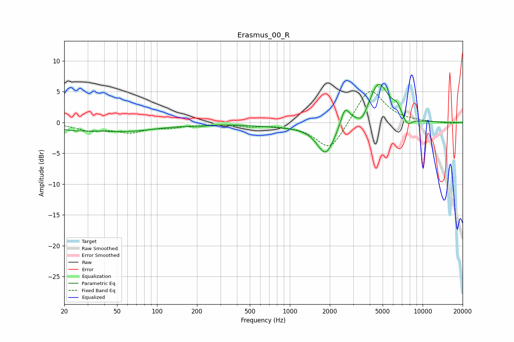

# Erasmus_00_R
See [usage instructions](https://github.com/jaakkopasanen/AutoEq#usage) for more options and info.

### Parametric EQs
Apply preamp of -6.3 dB when using parametric equalizer.

|   # | Type    |   Fc (Hz) |    Q |   Gain (dB) |
|-----|---------|-----------|------|-------------|
|   1 | Peaking |        23 | 1.12 |        -0.7 |
|   2 | Peaking |        57 | 0.54 |        -1.3 |
|   3 | Peaking |       202 | 2.47 |        -0.3 |
|   4 | Peaking |       941 | 0.56 |        -0.6 |
|   5 | Peaking |      1866 | 2.13 |        -5   |
|   6 | Peaking |      2605 | 4.31 |         3   |
|   7 | Peaking |      3507 | 3.91 |        -1.5 |
|   8 | Peaking |      4665 | 1.93 |         6.5 |
|   9 | Peaking |      6437 | 3.41 |         1.7 |
|  10 | Peaking |      7631 | 3.56 |        -1.6 |

### Fixed Band EQs
When using fixed band (also called graphic) equalizer, apply preamp of **-5.1 dB** (if available) and set gains manually with these parameters.

|   # | Type    |   Fc (Hz) |    Q |   Gain (dB) |
|-----|---------|-----------|------|-------------|
|   1 | Peaking |        31 | 1.41 |        -1.2 |
|   2 | Peaking |        62 | 1.41 |        -1.4 |
|   3 | Peaking |       125 | 1.41 |        -0.6 |
|   4 | Peaking |       250 | 1.41 |        -0.1 |
|   5 | Peaking |       500 | 1.41 |        -0.5 |
|   6 | Peaking |      1000 | 1.41 |        -0.3 |
|   7 | Peaking |      2000 | 1.41 |        -4.7 |
|   8 | Peaking |      4000 | 1.41 |         5.8 |
|   9 | Peaking |      8000 | 1.41 |         0.1 |
|  10 | Peaking |     16000 | 1.41 |        -0.2 |

### Graphs

