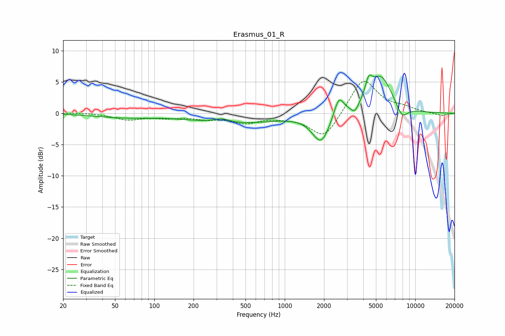

# Erasmus_01_R
See [usage instructions](https://github.com/jaakkopasanen/AutoEq#usage) for more options and info.

### Parametric EQs
Apply preamp of -6.2 dB when using parametric equalizer.

|   # | Type    |   Fc (Hz) |    Q |   Gain (dB) |
|-----|---------|-----------|------|-------------|
|   1 | Peaking |        58 | 0.63 |        -0.6 |
|   2 | Peaking |       329 | 2.22 |         0.7 |
|   3 | Peaking |       412 | 0.44 |        -1.6 |
|   4 | Peaking |      1592 | 1.32 |         0.1 |
|   5 | Peaking |      1899 | 2.08 |        -4.8 |
|   6 | Peaking |      2596 | 3.79 |         3.3 |
|   7 | Peaking |      3444 | 5.05 |        -1.3 |
|   8 | Peaking |      4399 | 5.26 |         2.7 |
|   9 | Peaking |      5453 | 1.57 |         5.9 |
|  10 | Peaking |      7925 | 2.98 |        -2.1 |

### Fixed Band EQs
When using fixed band (also called graphic) equalizer, apply preamp of **-5.2 dB** (if available) and set gains manually with these parameters.

|   # | Type    |   Fc (Hz) |    Q |   Gain (dB) |
|-----|---------|-----------|------|-------------|
|   1 | Peaking |        31 | 1.41 |         0.1 |
|   2 | Peaking |        62 | 1.41 |        -1   |
|   3 | Peaking |       125 | 1.41 |        -0.6 |
|   4 | Peaking |       250 | 1.41 |        -0.7 |
|   5 | Peaking |       500 | 1.41 |        -1.4 |
|   6 | Peaking |      1000 | 1.41 |        -0.4 |
|   7 | Peaking |      2000 | 1.41 |        -4.2 |
|   8 | Peaking |      4000 | 1.41 |         5.7 |
|   9 | Peaking |      8000 | 1.41 |         0.7 |
|  10 | Peaking |     16000 | 1.41 |        -0.4 |

### Graphs

