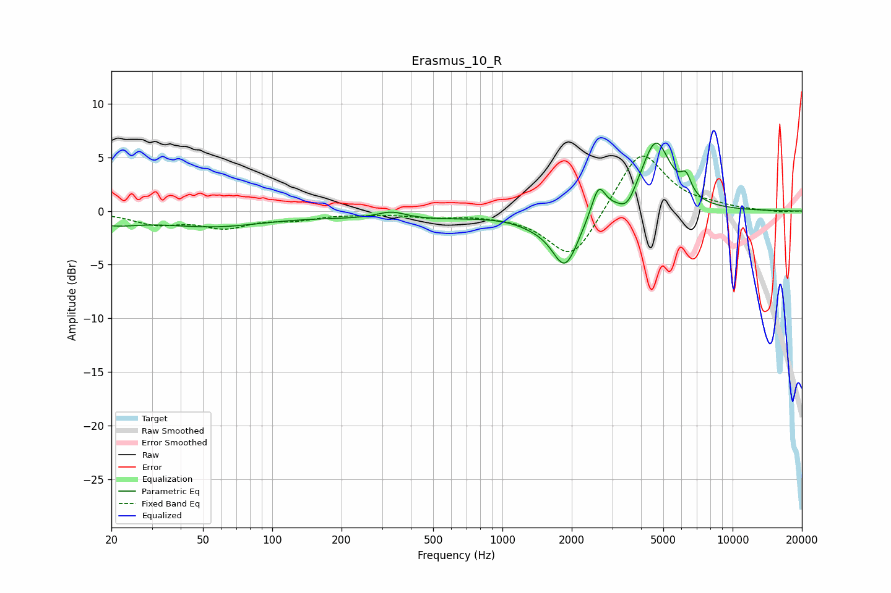

# Erasmus_10_R
See [usage instructions](https://github.com/jaakkopasanen/AutoEq#usage) for more options and info.

### Parametric EQs
Apply preamp of -6.4 dB when using parametric equalizer.

|   # | Type    |   Fc (Hz) |    Q |   Gain (dB) |
|-----|---------|-----------|------|-------------|
|   1 | Peaking |        20 | 1.2  |        -0.9 |
|   2 | Peaking |        55 | 0.6  |        -1.3 |
|   3 | Peaking |       329 | 2.16 |         0.7 |
|   4 | Peaking |       406 | 0.43 |        -0.7 |
|   5 | Peaking |      1366 | 1.69 |        -0.6 |
|   6 | Peaking |      1873 | 2.42 |        -4.9 |
|   7 | Peaking |      2613 | 4.68 |         2.8 |
|   8 | Peaking |      3485 | 4.06 |        -1.3 |
|   9 | Peaking |      4636 | 2.17 |         6.6 |
|  10 | Peaking |      6273 | 5.98 |         1.7 |

### Fixed Band EQs
When using fixed band (also called graphic) equalizer, apply preamp of **-5.2 dB** (if available) and set gains manually with these parameters.

|   # | Type    |   Fc (Hz) |    Q |   Gain (dB) |
|-----|---------|-----------|------|-------------|
|   1 | Peaking |        31 | 1.41 |        -1.1 |
|   2 | Peaking |        62 | 1.41 |        -1.4 |
|   3 | Peaking |       125 | 1.41 |        -0.6 |
|   4 | Peaking |       250 | 1.41 |        -0.2 |
|   5 | Peaking |       500 | 1.41 |        -0.5 |
|   6 | Peaking |      1000 | 1.41 |        -0.2 |
|   7 | Peaking |      2000 | 1.41 |        -4.7 |
|   8 | Peaking |      4000 | 1.41 |         5.9 |
|   9 | Peaking |      8000 | 1.41 |         0.3 |
|  10 | Peaking |     16000 | 1.41 |        -0.1 |

### Graphs

