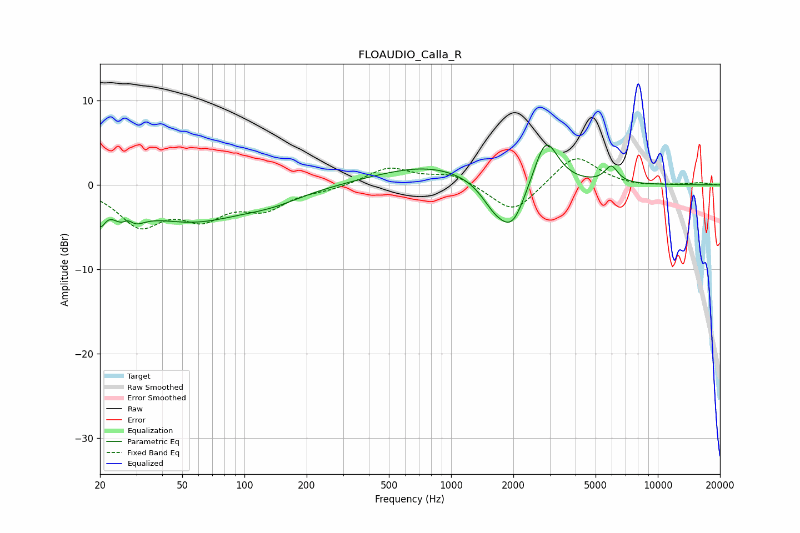

# FLOAUDIO_Calla_R
See [usage instructions](https://github.com/jaakkopasanen/AutoEq#usage) for more options and info.

### Parametric EQs
Apply preamp of -4.8 dB when using parametric equalizer.

|   # | Type    |   Fc (Hz) |    Q |   Gain (dB) |
|-----|---------|-----------|------|-------------|
|   1 | Peaking |        20 | 6    |        -2.6 |
|   2 | Peaking |        27 | 2.68 |        -4   |
|   3 | Peaking |        27 | 4.74 |         2.3 |
|   4 | Peaking |        55 | 0.55 |        -4   |
|   5 | Peaking |       137 | 0.93 |        -1.1 |
|   6 | Peaking |       781 | 0.56 |         2.3 |
|   7 | Peaking |      1614 | 2.17 |        -2.3 |
|   8 | Peaking |      1980 | 2.09 |        -5.2 |
|   9 | Peaking |      2871 | 2.42 |         5.9 |
|  10 | Peaking |      5957 | 4.32 |         2   |

### Fixed Band EQs
When using fixed band (also called graphic) equalizer, apply preamp of **-3.2 dB** (if available) and set gains manually with these parameters.

|   # | Type    |   Fc (Hz) |    Q |   Gain (dB) |
|-----|---------|-----------|------|-------------|
|   1 | Peaking |        31 | 1.41 |        -4.5 |
|   2 | Peaking |        62 | 1.41 |        -3.3 |
|   3 | Peaking |       125 | 1.41 |        -2.5 |
|   4 | Peaking |       250 | 1.41 |        -0.5 |
|   5 | Peaking |       500 | 1.41 |         2   |
|   6 | Peaking |      1000 | 1.41 |         1.3 |
|   7 | Peaking |      2000 | 1.41 |        -3.5 |
|   8 | Peaking |      4000 | 1.41 |         3.7 |
|   9 | Peaking |      8000 | 1.41 |        -0.2 |
|  10 | Peaking |     16000 | 1.41 |         0.2 |

### Graphs

