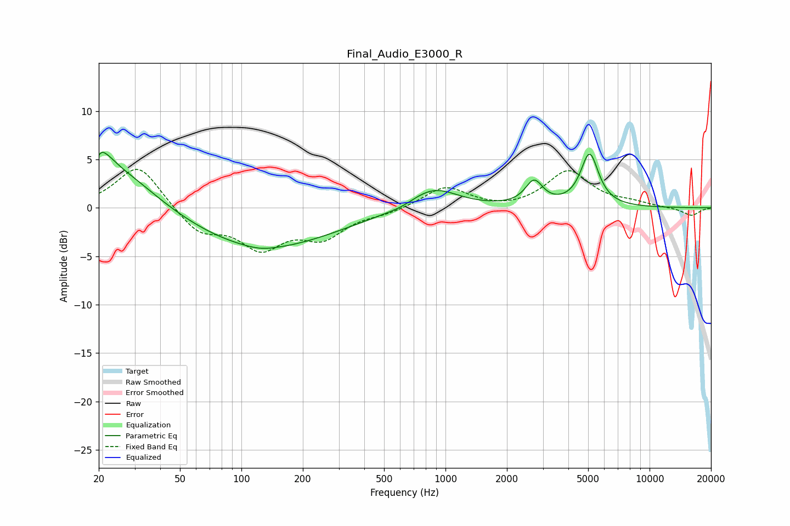

# Final_Audio_E3000_R
See [usage instructions](https://github.com/jaakkopasanen/AutoEq#usage) for more options and info.

### Parametric EQs
Apply preamp of -5.8 dB when using parametric equalizer.

|   # | Type    |   Fc (Hz) |    Q |   Gain (dB) |
|-----|---------|-----------|------|-------------|
|   1 | Peaking |        21 | 5.65 |         3.1 |
|   2 | Peaking |        21 | 5.99 |        -2.1 |
|   3 | Peaking |        22 | 2.95 |         1.1 |
|   4 | Peaking |        24 | 0.73 |         4.5 |
|   5 | Peaking |       125 | 2.08 |        -0.3 |
|   6 | Peaking |       125 | 0.4  |        -4.3 |
|   7 | Peaking |       608 | 2.35 |        -0.2 |
|   8 | Peaking |       868 | 1.17 |         2.3 |
|   9 | Peaking |      2717 | 3.33 |         2.5 |
|  10 | Peaking |      5082 | 3.21 |         5.4 |

### Fixed Band EQs
When using fixed band (also called graphic) equalizer, apply preamp of **-4.1 dB** (if available) and set gains manually with these parameters.

|   # | Type    |   Fc (Hz) |    Q |   Gain (dB) |
|-----|---------|-----------|------|-------------|
|   1 | Peaking |        31 | 1.41 |         4.6 |
|   2 | Peaking |        62 | 1.41 |        -2.5 |
|   3 | Peaking |       125 | 1.41 |        -3.8 |
|   4 | Peaking |       250 | 1.41 |        -2.8 |
|   5 | Peaking |       500 | 1.41 |        -0.5 |
|   6 | Peaking |      1000 | 1.41 |         2.2 |
|   7 | Peaking |      2000 | 1.41 |        -0.3 |
|   8 | Peaking |      4000 | 1.41 |         3.8 |
|   9 | Peaking |      8000 | 1.41 |         0.4 |
|  10 | Peaking |     16000 | 1.41 |        -0.8 |

### Graphs

