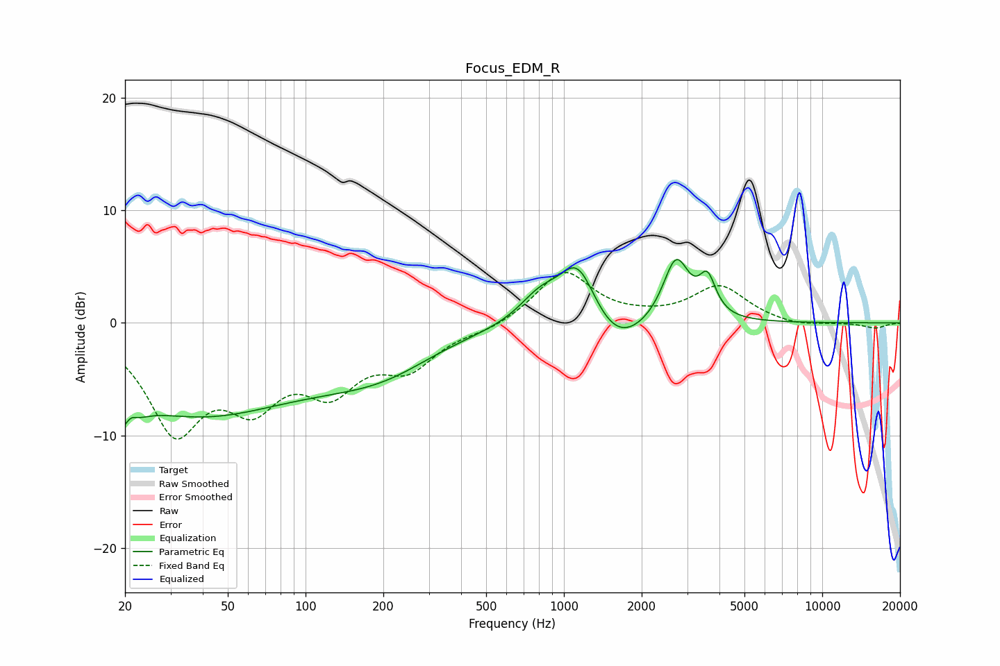

# Focus_EDM_R
See [usage instructions](https://github.com/jaakkopasanen/AutoEq#usage) for more options and info.

### Parametric EQs
Apply preamp of -5.7 dB when using parametric equalizer.

|   # | Type    |   Fc (Hz) |    Q |   Gain (dB) |
|-----|---------|-----------|------|-------------|
|   1 | Peaking |        20 | 3.43 |        -6.4 |
|   2 | Peaking |        21 | 4.7  |         4   |
|   3 | Peaking |        38 | 0.35 |        -7.8 |
|   4 | Peaking |       172 | 0.58 |        -2.8 |
|   5 | Peaking |       223 | 0.96 |        -0.6 |
|   6 | Peaking |       809 | 1.72 |         2.4 |
|   7 | Peaking |      1133 | 1.94 |         5.5 |
|   8 | Peaking |      1590 | 1.28 |        -2.9 |
|   9 | Peaking |      2717 | 2.78 |         5.7 |
|  10 | Peaking |      3596 | 4.45 |         3.2 |

### Fixed Band EQs
When using fixed band (also called graphic) equalizer, apply preamp of **-4.6 dB** (if available) and set gains manually with these parameters.

|   # | Type    |   Fc (Hz) |    Q |   Gain (dB) |
|-----|---------|-----------|------|-------------|
|   1 | Peaking |        31 | 1.41 |        -9   |
|   2 | Peaking |        62 | 1.41 |        -5.8 |
|   3 | Peaking |       125 | 1.41 |        -5   |
|   4 | Peaking |       250 | 1.41 |        -3.5 |
|   5 | Peaking |       500 | 1.41 |        -0.6 |
|   6 | Peaking |      1000 | 1.41 |         4.6 |
|   7 | Peaking |      2000 | 1.41 |         0.2 |
|   8 | Peaking |      4000 | 1.41 |         3.2 |
|   9 | Peaking |      8000 | 1.41 |        -0.4 |
|  10 | Peaking |     16000 | 1.41 |        -0.5 |

### Graphs

