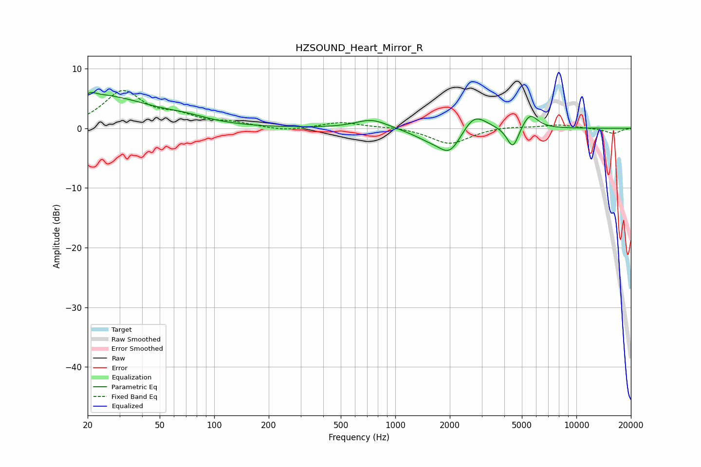

# HZSOUND_Heart_Mirror_R
See [usage instructions](https://github.com/jaakkopasanen/AutoEq#usage) for more options and info.

### Parametric EQs
Apply preamp of -6.1 dB when using parametric equalizer.

|   # | Type    |   Fc (Hz) |    Q |   Gain (dB) |
|-----|---------|-----------|------|-------------|
|   1 | Peaking |        20 | 5.97 |        -3   |
|   2 | Peaking |        20 | 5.79 |         3.2 |
|   3 | Peaking |        22 | 0.47 |         5.5 |
|   4 | Peaking |        70 | 1.23 |         0.6 |
|   5 | Peaking |       741 | 1.58 |         1.6 |
|   6 | Peaking |      1528 | 1.46 |        -1.4 |
|   7 | Peaking |      2007 | 2.18 |        -4   |
|   8 | Peaking |      2721 | 2.09 |         3.2 |
|   9 | Peaking |      4459 | 4.32 |        -3.8 |
|  10 | Peaking |      5532 | 3.24 |         2.6 |

### Fixed Band EQs
When using fixed band (also called graphic) equalizer, apply preamp of **-6.4 dB** (if available) and set gains manually with these parameters.

|   # | Type    |   Fc (Hz) |    Q |   Gain (dB) |
|-----|---------|-----------|------|-------------|
|   1 | Peaking |        31 | 1.41 |         6   |
|   2 | Peaking |        62 | 1.41 |         1.7 |
|   3 | Peaking |       125 | 1.41 |         0.8 |
|   4 | Peaking |       250 | 1.41 |        -0.5 |
|   5 | Peaking |       500 | 1.41 |         1   |
|   6 | Peaking |      1000 | 1.41 |         0.2 |
|   7 | Peaking |      2000 | 1.41 |        -2.7 |
|   8 | Peaking |      4000 | 1.41 |         0.4 |
|   9 | Peaking |      8000 | 1.41 |         0.6 |
|  10 | Peaking |     16000 | 1.41 |        -0.9 |

### Graphs

