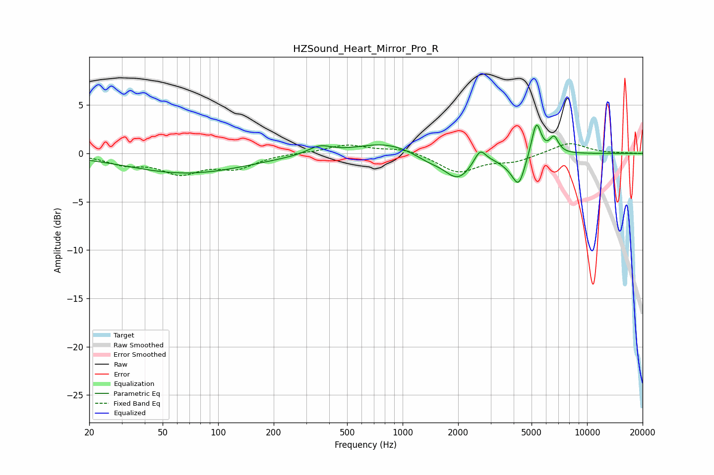

# HZSound_Heart_Mirror_Pro_R
See [usage instructions](https://github.com/jaakkopasanen/AutoEq#usage) for more options and info.

### Parametric EQs
Apply preamp of -3.0 dB when using parametric equalizer.

|   # | Type    |   Fc (Hz) |    Q |   Gain (dB) |
|-----|---------|-----------|------|-------------|
|   1 | Peaking |        68 | 0.44 |        -2   |
|   2 | Peaking |       355 | 2.2  |         0.9 |
|   3 | Peaking |       798 | 0.95 |         1.1 |
|   4 | Peaking |      1368 | 2.04 |        -0.6 |
|   5 | Peaking |      1991 | 1.85 |        -2.6 |
|   6 | Peaking |      2629 | 4.53 |         1.5 |
|   7 | Peaking |      3827 | 2.58 |        -0.8 |
|   8 | Peaking |      4268 | 4.29 |        -2.7 |
|   9 | Peaking |      5308 | 5.42 |         3.5 |
|  10 | Peaking |      6626 | 5.59 |         1.6 |

### Fixed Band EQs
When using fixed band (also called graphic) equalizer, apply preamp of **-1.1 dB** (if available) and set gains manually with these parameters.

|   # | Type    |   Fc (Hz) |    Q |   Gain (dB) |
|-----|---------|-----------|------|-------------|
|   1 | Peaking |        31 | 1.41 |        -1   |
|   2 | Peaking |        62 | 1.41 |        -1.9 |
|   3 | Peaking |       125 | 1.41 |        -1.4 |
|   4 | Peaking |       250 | 1.41 |         0.1 |
|   5 | Peaking |       500 | 1.41 |         0.9 |
|   6 | Peaking |      1000 | 1.41 |         0.5 |
|   7 | Peaking |      2000 | 1.41 |        -1.9 |
|   8 | Peaking |      4000 | 1.41 |        -0.8 |
|   9 | Peaking |      8000 | 1.41 |         1.2 |
|  10 | Peaking |     16000 | 1.41 |         0   |

### Graphs

