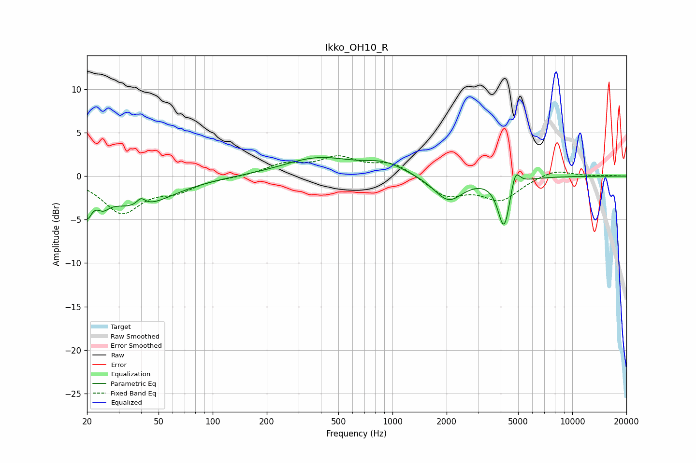

# Ikko_OH10_R
See [usage instructions](https://github.com/jaakkopasanen/AutoEq#usage) for more options and info.

### Parametric EQs
Apply preamp of -2.2 dB when using parametric equalizer.

|   # | Type    |   Fc (Hz) |    Q |   Gain (dB) |
|-----|---------|-----------|------|-------------|
|   1 | Peaking |        20 | 5.72 |        -2.9 |
|   2 | Peaking |        24 | 4.08 |        -1.2 |
|   3 | Peaking |        38 | 0.75 |        -3.5 |
|   4 | Peaking |        40 | 5.98 |        -1.9 |
|   5 | Peaking |        40 | 5.93 |         2.8 |
|   6 | Peaking |       385 | 0.74 |         2   |
|   7 | Peaking |       901 | 1.23 |         1.2 |
|   8 | Peaking |      2046 | 1.74 |        -2.9 |
|   9 | Peaking |      4175 | 4.18 |        -5.8 |
|  10 | Peaking |      4819 | 5.78 |         2.3 |

### Fixed Band EQs
When using fixed band (also called graphic) equalizer, apply preamp of **-2.4 dB** (if available) and set gains manually with these parameters.

|   # | Type    |   Fc (Hz) |    Q |   Gain (dB) |
|-----|---------|-----------|------|-------------|
|   1 | Peaking |        31 | 1.41 |        -4.1 |
|   2 | Peaking |        62 | 1.41 |        -1.4 |
|   3 | Peaking |       125 | 1.41 |        -0.1 |
|   4 | Peaking |       250 | 1.41 |         1.3 |
|   5 | Peaking |       500 | 1.41 |         1.9 |
|   6 | Peaking |      1000 | 1.41 |         1.5 |
|   7 | Peaking |      2000 | 1.41 |        -2.2 |
|   8 | Peaking |      4000 | 1.41 |        -2.6 |
|   9 | Peaking |      8000 | 1.41 |         0.8 |
|  10 | Peaking |     16000 | 1.41 |         0.1 |

### Graphs

