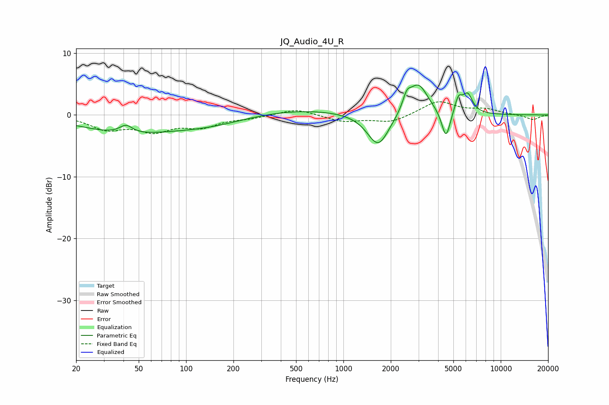

# JQ_Audio_4U_R
See [usage instructions](https://github.com/jaakkopasanen/AutoEq#usage) for more options and info.

### Parametric EQs
Apply preamp of -4.9 dB when using parametric equalizer.

|   # | Type    |   Fc (Hz) |    Q |   Gain (dB) |
|-----|---------|-----------|------|-------------|
|   1 | Peaking |        40 | 0.51 |        -2.7 |
|   2 | Peaking |        42 | 3.4  |         1.4 |
|   3 | Peaking |       139 | 0.54 |        -1.7 |
|   4 | Peaking |       474 | 0.4  |         1.1 |
|   5 | Peaking |      1665 | 2.01 |        -5.5 |
|   6 | Peaking |      2528 | 5.6  |         2   |
|   7 | Peaking |      2985 | 2.24 |         5.2 |
|   8 | Peaking |      4487 | 5.13 |        -4.7 |
|   9 | Peaking |      5378 | 6    |         2.4 |
|  10 | Peaking |      6159 | 4.29 |         3   |

### Fixed Band EQs
When using fixed band (also called graphic) equalizer, apply preamp of **-2.2 dB** (if available) and set gains manually with these parameters.

|   # | Type    |   Fc (Hz) |    Q |   Gain (dB) |
|-----|---------|-----------|------|-------------|
|   1 | Peaking |        31 | 1.41 |        -2.1 |
|   2 | Peaking |        62 | 1.41 |        -2.3 |
|   3 | Peaking |       125 | 1.41 |        -1.7 |
|   4 | Peaking |       250 | 1.41 |        -0.4 |
|   5 | Peaking |       500 | 1.41 |         1.1 |
|   6 | Peaking |      1000 | 1.41 |        -1.1 |
|   7 | Peaking |      2000 | 1.41 |        -1.2 |
|   8 | Peaking |      4000 | 1.41 |         2.2 |
|   9 | Peaking |      8000 | 1.41 |         0.8 |
|  10 | Peaking |     16000 | 1.41 |        -0.8 |

### Graphs

