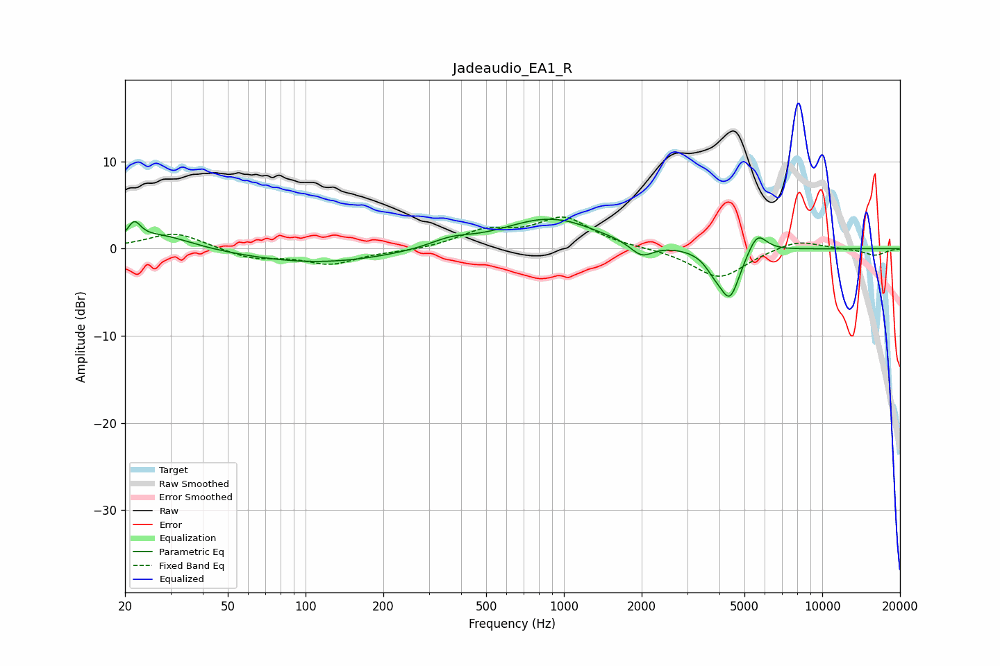

# Jadeaudio_EA1_R
See [usage instructions](https://github.com/jaakkopasanen/AutoEq#usage) for more options and info.

### Parametric EQs
Apply preamp of -3.5 dB when using parametric equalizer.

|   # | Type    |   Fc (Hz) |    Q |   Gain (dB) |
|-----|---------|-----------|------|-------------|
|   1 | Peaking |        22 | 5.76 |         2   |
|   2 | Peaking |        27 | 1.15 |         1.7 |
|   3 | Peaking |       112 | 0.5  |        -1.7 |
|   4 | Peaking |       364 | 1.77 |         0.9 |
|   5 | Peaking |       871 | 0.78 |         3.4 |
|   6 | Peaking |      1095 | 2.72 |         0.1 |
|   7 | Peaking |      1999 | 3.16 |        -1.6 |
|   8 | Peaking |      3818 | 3.95 |        -1.3 |
|   9 | Peaking |      4390 | 3.48 |        -5.5 |
|  10 | Peaking |      5600 | 3.8  |         2.4 |

### Fixed Band EQs
When using fixed band (also called graphic) equalizer, apply preamp of **-3.7 dB** (if available) and set gains manually with these parameters.

|   # | Type    |   Fc (Hz) |    Q |   Gain (dB) |
|-----|---------|-----------|------|-------------|
|   1 | Peaking |        31 | 1.41 |         1.9 |
|   2 | Peaking |        62 | 1.41 |        -1.1 |
|   3 | Peaking |       125 | 1.41 |        -1.7 |
|   4 | Peaking |       250 | 1.41 |        -0.3 |
|   5 | Peaking |       500 | 1.41 |         1.9 |
|   6 | Peaking |      1000 | 1.41 |         3.4 |
|   7 | Peaking |      2000 | 1.41 |         0   |
|   8 | Peaking |      4000 | 1.41 |        -3.4 |
|   9 | Peaking |      8000 | 1.41 |         1.1 |
|  10 | Peaking |     16000 | 1.41 |        -0.8 |

### Graphs

