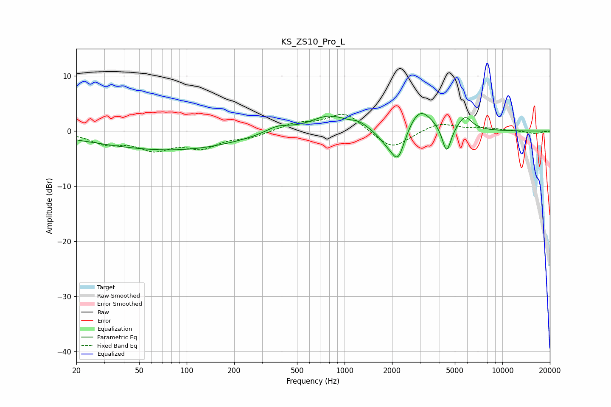

# KS_ZS10_Pro_L
See [usage instructions](https://github.com/jaakkopasanen/AutoEq#usage) for more options and info.

### Parametric EQs
Apply preamp of -3.3 dB when using parametric equalizer.

|   # | Type    |   Fc (Hz) |    Q |   Gain (dB) |
|-----|---------|-----------|------|-------------|
|   1 | Peaking |        65 | 0.33 |        -2.9 |
|   2 | Peaking |       132 | 0.46 |        -0.7 |
|   3 | Peaking |       377 | 1.79 |         1.3 |
|   4 | Peaking |       796 | 1.21 |         2.8 |
|   5 | Peaking |      1237 | 2.61 |         1   |
|   6 | Peaking |      1858 | 2.39 |        -1.9 |
|   7 | Peaking |      2184 | 3.23 |        -5.6 |
|   8 | Peaking |      2999 | 1.82 |         4.4 |
|   9 | Peaking |      4436 | 5.1  |        -5   |
|  10 | Peaking |      5798 | 3.19 |         2.5 |

### Fixed Band EQs
When using fixed band (also called graphic) equalizer, apply preamp of **-3.2 dB** (if available) and set gains manually with these parameters.

|   # | Type    |   Fc (Hz) |    Q |   Gain (dB) |
|-----|---------|-----------|------|-------------|
|   1 | Peaking |        31 | 1.41 |        -2   |
|   2 | Peaking |        62 | 1.41 |        -2.9 |
|   3 | Peaking |       125 | 1.41 |        -2.6 |
|   4 | Peaking |       250 | 1.41 |        -1   |
|   5 | Peaking |       500 | 1.41 |         1.4 |
|   6 | Peaking |      1000 | 1.41 |         3.4 |
|   7 | Peaking |      2000 | 1.41 |        -3.5 |
|   8 | Peaking |      4000 | 1.41 |         1.6 |
|   9 | Peaking |      8000 | 1.41 |         0.5 |
|  10 | Peaking |     16000 | 1.41 |        -0.5 |

### Graphs

